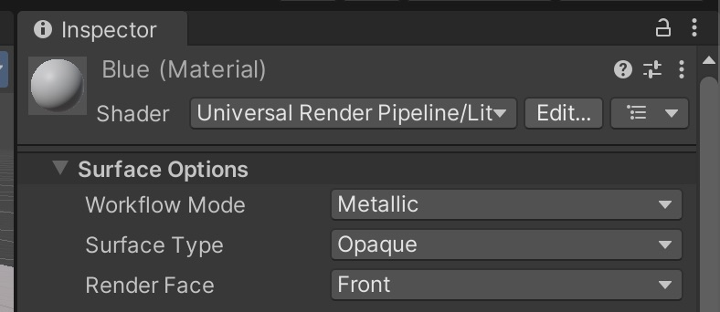
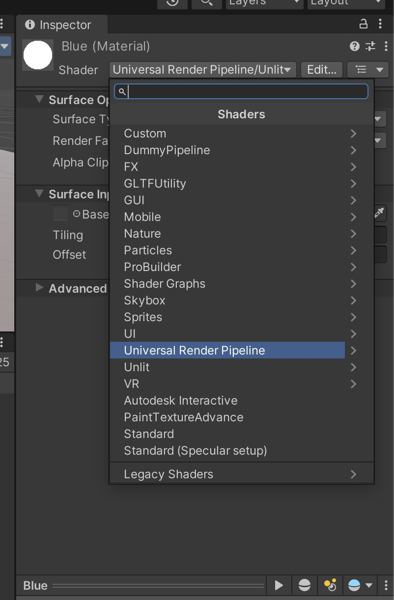
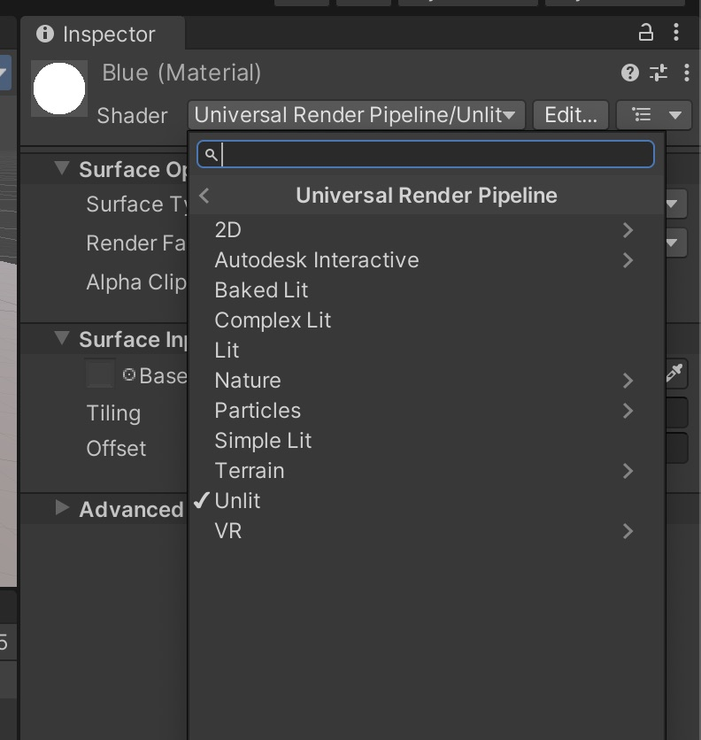
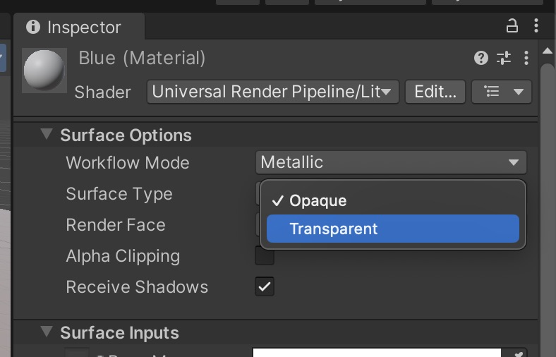
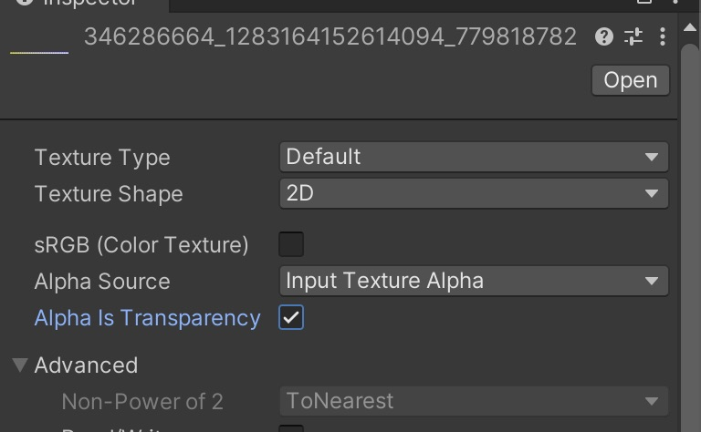
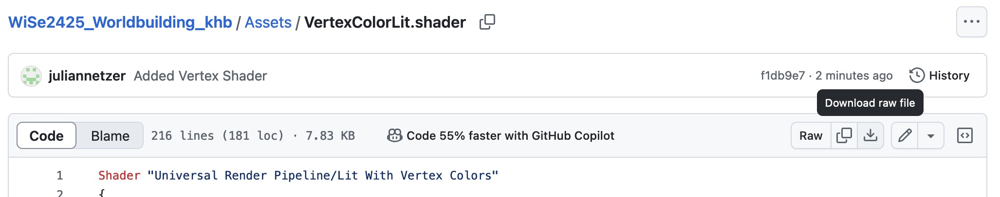

#  Basic 3D Objects

Unity provides a set of basic 3D models that can be used for prototyping or as foundational elements in a scene. These include Cubes, Spheres, Planes, Cylinders, Capsules, and Quad Primitives.

**Adding 3D Object to your scene**
You can add them to your scene when you got to GameObject -> 3D Object

**Adjusting the Model**
Once added, the 3D object will appear in the Hierarchy and Scene View. Use the Inspector to modify properties such as scale, position, and rotation.

> You can also use these simple 3D Objects to build complex scenes, for example when using quads as surfaces and then apply a texture to it you can build simple 2.5D-worlds like [here](https://vk-showcase.kh-berlin.de/project/whomans).

#  Materials/ Shaders/ Textures 

Every 3D-Assets in Unity needs a material that is attached to it, and every material needs a shader. The material is the place where the information like colors and textures are stored. The shader then tells unity how to render these information. (you can compare it to using a pencil: the material stores the color, the shader stores whether it is a wax crayon or a colored pencil). 

## Create a new material: 

Click on Assets -> Create -> Material

Now you can add some textures and change the colors. 
To apply the material to an object, just drag and drop it onto the object. 

Most materials have a certain set of textures (images) applied. The most important ones in Unity are: 

- Albedo/Base Map: The main color texture that defines the basic surface appearance and color of a material. It represents how the surface looks under pure white light without any lighting effects.
- Specular Map: Controls the shininess and highlight intensity across different parts of the surface. Bright areas in the map appear more reflective/shiny, while dark areas appear more matte.
- Normal Map: Adds detailed surface bumps and wrinkles without requiring extra geometry. It stores surface angle deviations in RGB channels, creating the illusion of intricate surface detail through light interaction.
- Height Map: Creates parallax effects by simulating surface depth. Lighter areas appear raised while darker areas appear sunken, adding depth perception when viewing the surface at angles.
- Occlusion Map: Represents how much ambient light reaches different parts of the surface. Dark areas receive less ambient light, enhancing the perception of crevices and adding depth to surface details.

## Shaders 
Shaders are small programs that determine how objects appear in a 3D scene by controlling how surfaces interact with light and textures. They are used to define visual effects like colors, reflections, transparency, and more. Unity uses shaders to create realistic or stylized materials, enabling a wide range of visual styles for your projects. 

The most important ones for you are: 
- Lit: The standard shader with all the standard settings, is affected by your scene lighing
- Unlit: Minimal shader, that is not effected by lighting. 

You can find the shaders by clicking on: 

## Working with Transparency
To work with transparency you can either select a shaders that directly supports transcparency (e.g. Unlit -> Transparency) or you can change the render setting of your shader, in case of the Lit shader like this: 

> When using a texture with transparency (e.g., PNG with an alpha channel), you must adjust its import settings: Select the texture in the Project Window. -> In the Inspector, enable the Alpha or Transparency setting. -> Apply the changes. 
 
## Places to get free Texture
There are many online resources where you can find free textures for various materials, including wood, metal, fabric, and more. Below are some recommended platforms that offer free textures for use in your projects.

- [Polyhaven](https://polyhaven.com/textures)
- [Unity Asset Store](https://assetstore.unity.com/?category=2d%2Ftextures-materials&free=true&orderBy=1)
- [AmbientCG](https://ambientcg.com/)

### Import Settings for Textures 

Proper import settings are crucial to ensure that textures, models, and other assets appear correctly in Unity. Incorrect configurations can lead to issues such as blurry textures, incorrect scaling, or missing transparency. When downloading or exporting assets from external sources, adjusting settings like file format, resolution, and compression helps maintain visual quality and performance.

Below is an example configuration for Polyhaven.

- Resolution: 2K (or on better machine, or complex textures 4K)
- ZIP 
- .JPGs (or for better quality .PNG)

Conversion Table for using Polyhaven Materials: 
| Unity            | Polyhaven   |
| ---------------- | ----------- |
| Albedo/ Base Map | Diffuse     |
| Specular Map     | Spec        |
| Normal Map       | Normal (GL) |
| Height Map       | Displacement|
| Occlusion Map    | AO          |

#  Working with imported 3D Assets

In most cases, 3D assets are created in external software such as Blender, Maya, 3ds Max, or ZBrush and then imported into Unity for use in a project.

**Supported 3D File Formats**

Unity supports various 3D model formats, including:

- FBX (.fbx) – Recommended for compatibility and animation support.
- OBJ (.obj) – Common for static models but does not support animations.
- GLTF/GLB (.gltf, .glb) – Optimized for web and real-time rendering.
- Unity-native files – Blender (.blend) files can be imported directly, but it is recommended to export them as FBX for better control.

**Importing Assets into Unity**

There are multiple ways to import 3D assets into your Unity project:
Method 1: Drag and Drop (Quick and Easy)

- Open the Project Window in Unity.
- Locate the Assets folder (or a subfolder like Models if you have one).
- Drag your 3D model file from your file explorer (Windows/Mac) directly into the Assets window.
- The asset will now appear in your Unity project and can be placed in a scene.

Method 2: Using the Unity Import Menu (For Better Control)

- In Unity, go to Assets → Import New Asset...
- Select the 3D model file you want to import.
- Click Import to add the asset to your project.

**Adjusting Import Settings**

Once imported, select the 3D model in the Project Window, and check the Inspector panel to adjust settings such as:

- Scale Factor – Ensures the model is properly scaled in Unity.
- Normals & Tangents – Controls how lighting interacts with the model.
- Materials & Textures – Ensures textures are correctly applied if they were included in the export. (details in the section Troubleshooting below)
- Rig & Animation Settings – If the model includes a rig or animations, configure them under the Rig and Animation tabs. (we will have a look at this in session 2)

**Placing the Asset in the Scene**

- Drag the imported 3D model from the Project Window into the Hierarchy or Scene View.
- Adjust the position, rotation, and scale in the Inspector as needed.

[Unity Documentation on file formats](https://docs.unity3d.com/2020.1/Documentation/Manual/3D-formats.html)

## Best places to get free 3D-Assets 

- [Unity Asset Store](https://assetstore.unity.com/?category=3d%2Fenvironments&free=true&orderBy=1): Large library of assets, specifically for unity, sometimes with animations 
- [Sketchfab](https://sketchfab.com): Large library for free Assets, also from museums etc., mixed quality & licenses 
- [Mixamo](https://www.mixamo.com/): Large library of (mostly) humanoid Avatars & Animations
- [Polyhaven](https://polyhaven.com/models): Not that many models, but all can be used for any purpose (commercial and personal)
- [Everything library](https://davidoreilly.itch.io/): library of objects from the (very good) game "Everything", see hint below, a lot of models, all in the same style (low poly), can be used in all projects, but an attribution is necessary[license](https://creativecommons.org/licenses/by/4.0/)
- [NASA 3D Models](https://nasa3d.arc.nasa.gov/models): library of space related objects, different quality, but some are quiet nice
- [Three D Scans](https://threedscans.com/): library of 3d scanned statues & some animals, very detailed 
- [ArtStation](https://www.artstation.com/marketplace/game-dev/assets?section=free): Plattform, mixed quality, different
- [Quaternius](https://quaternius.com/): nice low poly packs, most of them free to use
- [OpenGameArt](https://opengameart.org/art-search-advanced?keys=&field_art_type_tid%5B%5D=10&sort_by=count&sort_order=DESC): a lot, mixed quality
- [Dimensiva](https://dimensiva.com/free-3d-models/): mostly furniture

> Trees are rather difficult to render in Unity, so either use Low-Poly Versions, or you can also find some in the Assets Store (e.g. [Realistic Pines](https://assetstore.unity.com/packages/3d/vegetation/trees/realistic-pine-tree-pack-232166), [Polygon Trees](https://assetstore.unity.com/packages/3d/vegetation/trees/polygon-trees-224068))

### Using Everything Models 

To use the Everything Models: 
1. download this shader: [VertexLitShader](Assets/VertexColorLit.shader) (go to "Download Raw File")

2. Drag and Drop the shader in your Unity Project Window
3. Create a new material -> Drag and Drop the shader on this Material
4. Apply this material to the everything Model in your scene 

## Troubleshooting

### Material is displayed pink: 
Probably a problem with the renderpipeline, find the material in the project window, select it and then click on "Edit -> Rendering -> Materials -> Convert Selected Built-in Materials to URP". If this does not work, either create a new material and assign it, or if you can get the asset in a different fileformat try that. 

### Imported object does not have a color/texture 
- See whether the asset comes with a "material" or "texture" folder, if yes, try: 
	- select the 3D-model in the project window, and go to the "Materials"-Tab in the Inspector window, select Location -> Use External Materials (Legacy) and click "Apply"
	- If this does not work: switch to Location -> Use Embedded Materials again and click on "Extract Materials" and then on "Apply". This extract the Materials from the model and you can manually assign the textures/colors etc. 
- If it does not come with an extra folder: 
	- select the asset in the Project window and click on "Extract Textures" and/or "Extract Materials" in the Inspector (in the "Materials" Tab)
	-  If there are still no materials/textures you have to manually create them/ or find a new asset

# Performance?

Especially when choosing the 3D assets and lights, you should have in mind where your scene will be played in the end, e.g. as desktop VR, i.e. on a powerful computer, or in mobile VR (e.g. an Oculus Quest). As all devices only have a limited performance capacity.

To reduce the triangles of an object, you can use a 3D-modelling-software like blender, you can find more information here: 
[Simplify a Mesh in Blender](https://all3dp.com/2/blender-simplify-mesh-simply-explained/)
