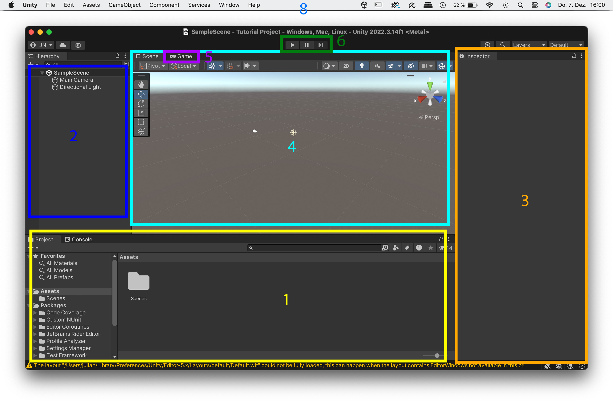

# Working with the Unity Editor

This part serves as an introduction to the Unity Editor, providing an overview of its core components, interface, and essential concepts. It provides tools for designing scenes, managing assets, scripting behaviors, and testing gameplay.

We begin with a **general Unity glossary**, clarifying key terms such as *scenes, game objects, components,* and *assets*. These concepts are fundamental for working within Unity and developing a structured approach to project management. After that we take a look at the **Unity Editor user interface**, detailing essential tools such as the *Hierarchy, Inspector, Scene View, Game View*, and *Project Window*.  

Additionally, this session introduces best practices for **structuring Unity projects**, highlighting the importance of clear file organization and version control. As Unity projects grow in complexity, maintaining a logical structure becomes essential.

For further exploration, a selection of **external tutorials and resources** is provided, offering different approaches to getting started with Unity. These references will be useful for reinforcing the topics covered in this session and expanding technical proficiency.

> The additional ressources are always highlighted with this light grey box. 

## General Unity Glossary

### Unity Hub
The Unity Hub (which you already used in the installation process) is a central application for managing Unity installations, projects, and settings. It allows users to install and switch between different Unity versions. Additionally, the Hub provides quick access to all Unity projects, enabling efficient organization and setup. It also includes options for learning resources, licensing management, and project templates

### Unity Editor 
The Unity Editor is the main interface for developing interactive 3D environments, games, and applications in Unity. It provides tools for designing scenes, managing assets, scripting behaviors, and testing gameplay.

### Build 
In Unity, a build is the final exported version of your project that can run independently without requiring the Unity Editor. When you create a build, Unity compiles all necessary assets, scripts, and settings into an executable format tailored for a specific platform (e.g., Windows, macOS, Android, WebGL). This process ensures that the game or application can be distributed and played without additional dependencies, making it ready for deployment or sharing.

### Project 
In Unity, a **project** is the complete set of files and assets that make up your game or application. It is stored as a folder on your hard drive and contains all necessary components, including **scenes, assets, scripts, settings, and libraries**. Unlike a single file (e.g., a Photoshop or Blender file), a Unity project is structured as a directory with multiple subfolders, ensuring modularity and flexibility. Managing a project properly is essential for maintaining organization, version control, and collaboration.

### Scenes 
A scene is a container that holds all the elements of a specific part of your game or application. Scenes are often used like levels in a game, but they can also represent menus, cutscenes, or different environments. Each scene stores the arrangement of GameObjects, assets, lighting, and interactions, defining how these elements are positioned and behave in relation to each other. A project can have multiple scenes, and not all of them need to be included in the final build.

### Assets 
Assets are all the files and resources that make up a project. They include 3D models, textures, materials, audio files, scripts, animations, prefabs, and more. Assets are stored in the Assets folder within the project directory and can be imported, modified, and reused across different scenes. Unlike GameObjects, which exist within a scene, assets are persistent files saved on your computer

### GameObjects
GameObjects are the fundamental building blocks of a scene. They represent all interactive and visual elements in the game world, such as characters, lights, cameras, and environmental objects. Unlike assets, GameObjects are not stored as separate files in the Assets folder; they exist only within a scene.

### Component 
In Unity, components are the building blocks that define the functionality of a GameObject. Each GameObject consists of one or more components that control its appearance, behavior, and interactions. For example, a Mesh Renderer component makes an object visible in the scene, while a Rigidbody component enables physics-based movement. Components can be added, removed, or modified in the Inspector to customize how a GameObject functions within the game.

## Unity Editor User Interface

### 1. Project window
The Project Window serves as a file explorer within Unity, allowing you to access and manage all assets used in your project. Unlike single-file applications like Blender, a Unity project is structured as a folder containing multiple files and subdirectories. Pressing "Save" in Unity only saves the currently open scene, while the rest of the project remains stored within the project folder.

> Backup recommendation: Always duplicate the entire project folder before making significant changes. Alternatively, consider using a version control system like Git for better project management. You can find a tutorial for using git here: [Using Unity with git](https://medium.com/@linojon/git-and-unity-getting-started-ad7c42be8324)

### 2. Hierarchy
The Hierarchy Window displays all GameObjects present in the currently open scene. This panel helps organize objects in a parent-child structure, allowing for better control over scene elements and their relationships.

> In Unity, a parent-child relationship refers to the hierarchical structuring of GameObjects. A parent GameObject can have one or more child GameObjects attached to it. When the parent moves, rotates, or scales, the child objects inherit these transformations. This structure is useful for organizing objects, grouping elements, and creating dependencies, such as attaching a camera to a player character.

### 3. Inspector
The Inspector Window provides detailed information about the selected GameObject or asset. It displays all components attached to a GameObject, as well as adjustable properties for assets. The Inspector allows users to modify values, add or remove components, and configure settings for objects and resources in the project.

### 4. Scene View 

The Scene View is the interactive workspace where the current 3D scene is displayed and edited. It allows users to navigate, manipulate objects, and adjust the environment in real-time.

#### Navigation in the Scene View: 
	
	- Rotate: option + mouse click
	- Move: option + command + mouse click
	- Zoom: Two finger scroll 
	- double-click on object: focus on object 

#### Scene View Tools
- Use the Scene Gizmo (a) to switch to a single axis view 
- You can switch between 2D & 3D view (b) (helpful for UI work)
- You can change the perspective mode (c)
- Toggle visibily of gizmos (d)
- Tools to move/rotate/scale objects (e)

### 5. Game View 
The Game View provides a preview of how the game will appear to the player. By pressing "Play", Unity enters play mode, allowing users to test gameplay, animations, and scripts in real time. The Game View also includes options to adjust resolution and aspect ratio, ensuring the game looks correct on different screen sizes.

> For now we only need the Scene View, we will have a closer look at the Game View in Session 2 

### 6. Toolbar 
The Toolbar controls the Game Mode of the current scene, enabling users to play, pause, and stop the game during testing.

### 7. Menubar
The Menu Bar provides access to essential functions, including:
- Creating assets and GameObjects
- Adjusting window layouts
- Saving the current scene
- Configuring project settings

You can find a Cheat Sheet with the Basic Unity UI Elements here: [Untiy Cheat Sheet PDF](https://github.com/juliannetzer/arfoundation-demos_khb_sose22/blob/master/Handouts/220501_UnityCheatsheet.pdf)

## Further tutorials for getting started in Unity: 
- [Everest Pipkin: Quickstart Unity 3d ](https://docs.google.com/document/d/1xwGpjgIRhZAqprW-jECGN1WNh_o2jfO_84hjLQ59TIQ/edit)
- [Brackeys: How to make a Video Game - Getting Started](https://www.youtube.com/watch?v=j48LtUkZRjU&list=PLPV2KyIb3jR5QFsefuO2RlAgWEz6EvVi6)
- [Ray Wenderlich: Unity Getting started](https://www.kodeco.com/7514-introduction-to-unity-getting-started-part-1-2)
- [The Ultimate Beginner Guide to Unity](https://www.freecodecamp.org/news/the-ultimate-beginners-guide-to-game-development-in-unity-f9bfe972c2b5/)

#  How to structure your unity projects

A well-structured Unity project is essential for maintaining organization, efficiency, and scalability. As projects grow, managing assets, scenes, and scripts becomes increasingly complex. Proper folder organization helps prevent clutter and makes collaboration easier.

Key best practices include:
- Organizing assets into folders (e.g., Textures, Models, Scripts, Prefabs, Scenes). You can do this in the project window with a right click -> Create -> Folder. 
- Using clear naming conventions for files and GameObjects.

[Best practices of organizing your unity project](https://unity.com/how-to/organizing-your-project)

[Go to next section](1_Structuring.md) 
[Back to the overview](readme.md)

