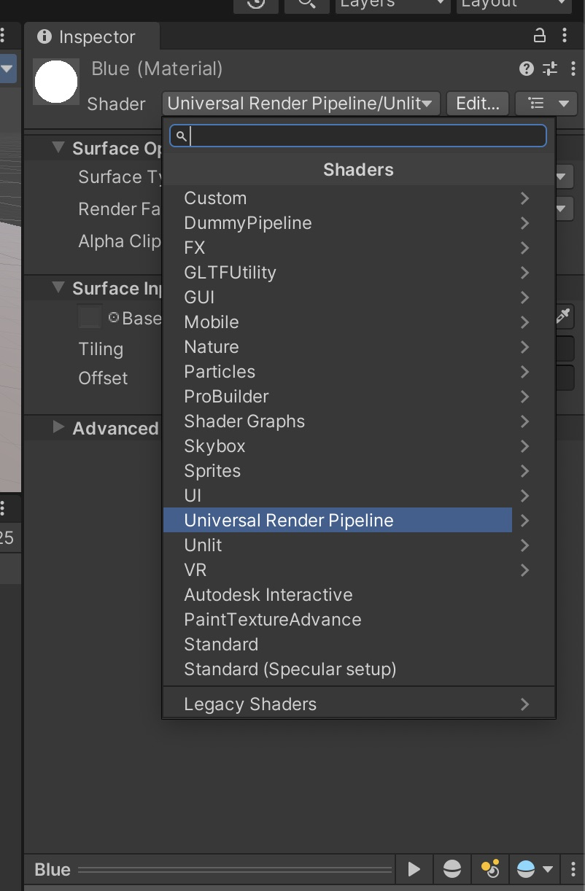

# Materials/ Shaders/ Textures 

Every 3D-Assets in Unity needs a material that is attached to it, and every material needs a shader. The material is the place where the information like colors and textures are stored. The shader then tells unity how to render these information. (you can compare it to using a pencil: the material stores the color, the shader stores whether it is a wax crayon or a colored pencil). 

## Create a new material: 

Click on Assets -> Create -> Material

Now you can add some textures and change the colors. 
To apply the material to an object, just drag and drop it onto the object. 

Most materials have a certain set of textures (images) applied. The most important ones in Unity are: 

- Albedo/Base Map: The main color texture that defines the basic surface appearance and color of a material. It represents how the surface looks under pure white light without any lighting effects.
- Specular Map: Controls the shininess and highlight intensity across different parts of the surface. Bright areas in the map appear more reflective/shiny, while dark areas appear more matte.
- Normal Map: Adds detailed surface bumps and wrinkles without requiring extra geometry. It stores surface angle deviations in RGB channels, creating the illusion of intricate surface detail through light interaction.
- Height Map: Creates parallax effects by simulating surface depth. Lighter areas appear raised while darker areas appear sunken, adding depth perception when viewing the surface at angles.
- Occlusion Map: Represents how much ambient light reaches different parts of the surface. Dark areas receive less ambient light, enhancing the perception of crevices and adding depth to surface details.

## Shaders 
Shaders are small programs that determine how objects appear in a 3D scene by controlling how surfaces interact with light and textures. They are used to define visual effects like colors, reflections, transparency, and more. Unity uses shaders to create realistic or stylized materials, enabling a wide range of visual styles for your projects. 

The most important ones for you are: 
- Lit: The standard shader with all the standard settings, is affected by your scene lighing
- Unlit: Minimal shader, that is not effected by lighting.

You can find the shaders by clicking on: 

## Working with Transparency
To work with transparency you can either select a shaders that directly supports transcparency (e.g. Unlit -> Transparency) or you can change the render setting of your shader, in case of the Lit shader like this: 

> When using a texture with transparency (e.g., PNG with an alpha channel), you must adjust its import settings: Select the texture in the Project Window. -> In the Inspector, enable the Alpha or Transparency setting. -> Apply the changes. 
 
## Textures

Textures are images applied to the surface of 3D objects to give them visual detail and realism. Instead of relying solely on geometry, textures allow you to simulate materials like wood, metal, fabric, or stone by wrapping 2D images onto 3D models.

In Unity, textures are usually part of a material, which defines how the surface looks under different lighting conditions. You can use different types of textures—such as albedo (color), normal maps for surface detail, or specular maps for shininess—to enhance the visual complexity of your objects without increasing geometry.

### Importing a texture 

Unity supports a range of image formats, i would recommend using .jpg or .png-images. To support the texture to your project you can drag and drop your image in the project window. 

### Places to get free Texture
There are many online resources where you can find free textures for various materials, including wood, metal, fabric, and more. Below are some recommended platforms that offer free textures for use in your projects.

- [Polyhaven](https://polyhaven.com/textures)
- [Unity Asset Store](https://assetstore.unity.com/?category=2d%2Ftextures-materials&free=true&orderBy=1)
- [AmbientCG](https://ambientcg.com/)

### Import Settings for Textures 

Proper import settings are crucial to ensure that textures, models, and other assets appear correctly in Unity. Incorrect configurations can lead to issues such as blurry textures, incorrect scaling, or missing transparency. When downloading or exporting assets from external sources, adjusting settings like file format, resolution, and compression helps maintain visual quality and performance.

Below is an example configuration for Polyhaven.

- Resolution: 2K (or on better machine, or complex textures 4K)
- ZIP 
- .JPGs (or for better quality .PNG)

Conversion Table for using Polyhaven Materials: 
| Unity            | Polyhaven   |
| ---------------- | ----------- |
| Albedo/ Base Map | Diffuse     |
| Specular Map     | Spec        |
| Normal Map       | Normal (GL) |
| Height Map       | Displacement|
| Occlusion Map    | AO          |

# Exercise: Create and Apply Materials

Goal: Understand how to modify an object’s appearance using materials.

- Create a new Material (Assets → Create → Material).
- Change the Albedo color and apply it to at least one object.
- Download a free texture from Polyhaven.
- Apply the texture to a new material and use it on a different object.
- Experiment with different Shader types (Lit, Unlit, Transparent) and observe the effects.

[Go to next section](1_Imported3DAssets.md)\
[Back to the overview](readme.md)