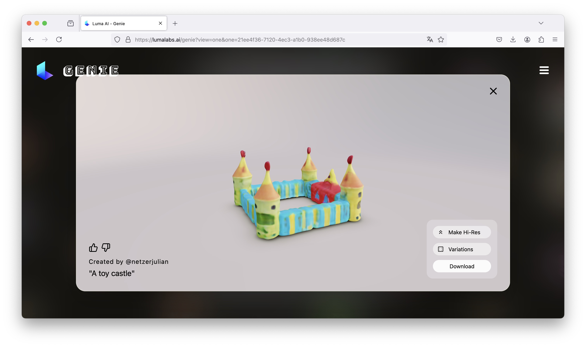
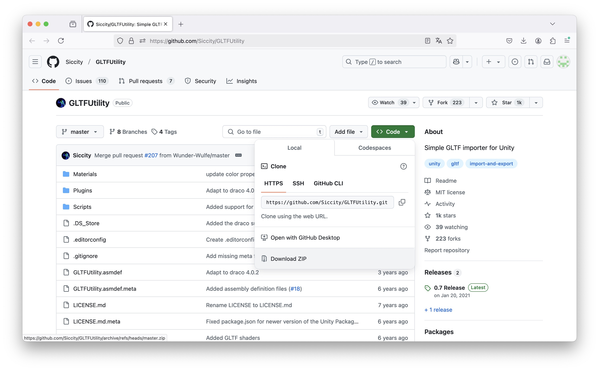
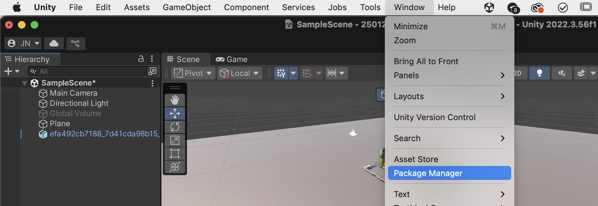
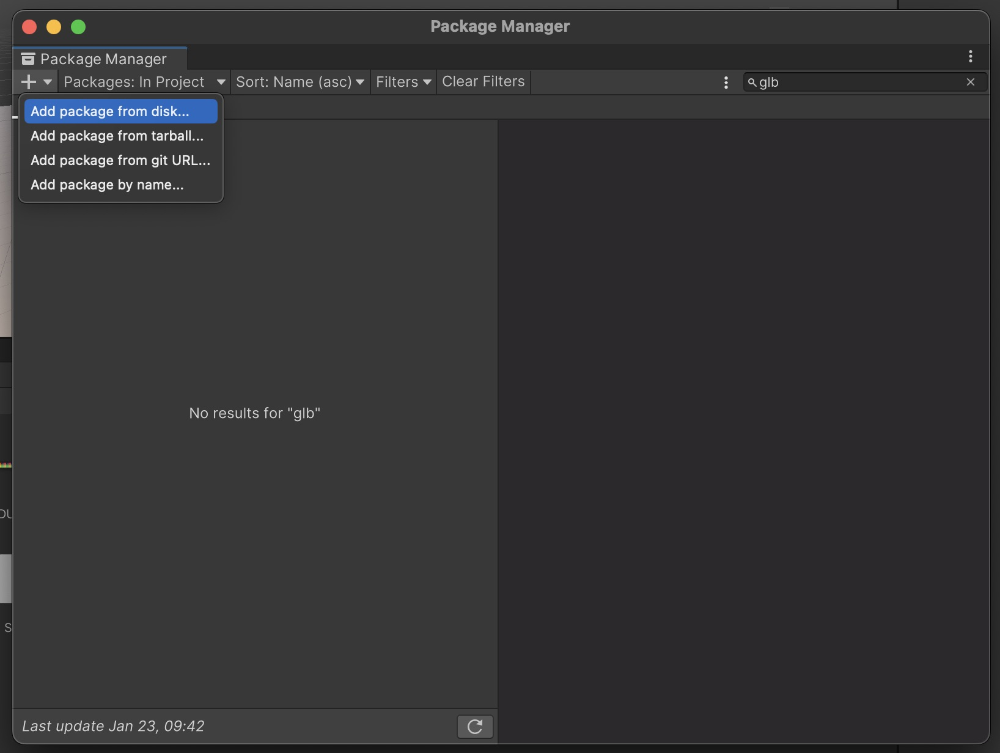
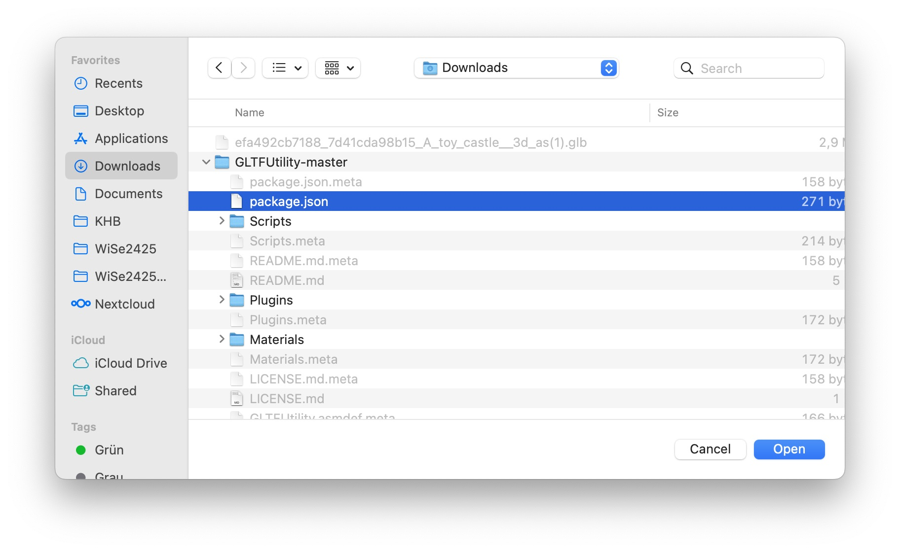

# AI Tools

Artificial Intelligence is increasingly being used to assist in 3D content creation, making it easier to generate complex models with minimal effort. AI-driven tools like Lumalabs Genie and Hyper3D allow users to create 3D assets from text descriptions and images, streamlining the modeling process. These tools are useful for rapid prototyping, concept development, or generating base models that can be further refined in traditional 3D software.

### Lumalabs Genie

A platform designed to generate 3D models from text and images.
[Link](https://lumalabs.ai/genie?view=create)

## Using the Lumalabs models in Unity	
Since Lumalabs uses the .glb-fileformat we have to install a plugin in Unity first, for this follow these steps: 
Go to https://github.com/Siccity/GLTFUtility and click on "Code" -> "Download ZIP"

Then extract and .zip-file and go back to Unity. Click on "Window" -> "Package Manager"

Click on the + and select "Add package from disk"

Then find your extracted .zip-file and open the "package.json"-file. 

Now you should be able to open the models from Lumalabs.

### Hyper3D 

An AI-powered 3D model generator that creates 3D assets from text and images.
- [Hyper3D - Rodin](https://hyper3d.ai/)

# Exercise: Generate a 3D Model Using AI Tools

Goal: Use an AI-powered tool to generate a 3D asset.

- Go to Lumalabs Genie or Hyper3D.
- Enter a text description (e.g., "futuristic chair" or "stone statue") and generate a model.
- Download the .glb file and follow these steps:
- Install the GLTF Utility Plugin in Unity (if needed).
- Import the model and adjust its position and scale.
- Place the AI-generated object in your scene.

# Advanced Tools for modelling 3D Objects

For greater control over 3D asset creation, dedicated 3D modeling software such as Blender, Maya, or Cinema4D provides advanced tools for sculpting, texturing, and optimizing models for use in Unity. Unlike browser-based or AI-generated models, these programs allow for precise customization, efficient topology control, and animation rigging.

I would recommend to use the open source tool Blender. But getting started will take some time, you can find a good tutorial series here: [Blender Guru - Beginner Tutorial](https://www.youtube.com/playlist?list=PLjEaoINr3zgEPv5y--4MKpciLaoQYZB1Z)

[Go to Exercise for Session 2](2_Exercise.md) 
[Back to the overview](readme.md)