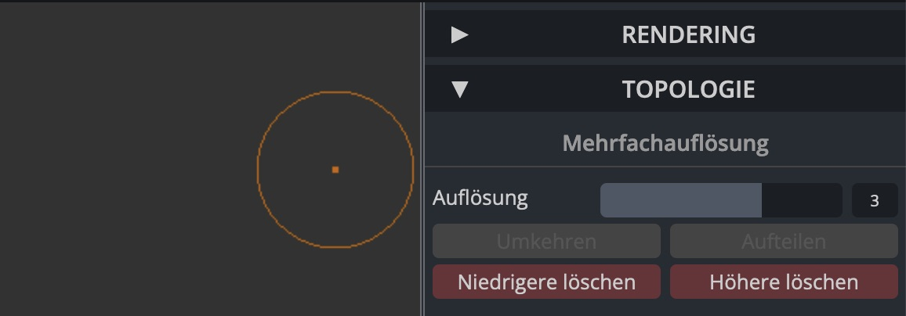
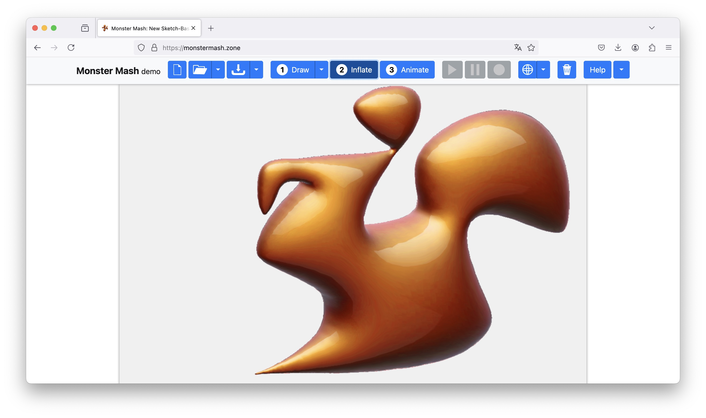

##  Online Sculpting Tools

For quick prototyping and experimentation, online sculpting tools provide a convenient way to create and manipulate 3D models without requiring dedicated 3D modeling software. These tools allow for intuitive, browser-based modeling, making them useful for generating assets that can later be imported into Unity.

### SculptGL 

An  WebGL-based sculpting application that enables users to create and refine 3D models directly in their browser.
[Link](https://stephaneginier.com/sculptgl/)

When using this tool, please set the resolution to 3: 

### MonsterMash

A sketch-based modeling and animation tool that allows users to draw 2D characters, inflate them into 3D models, and animate them.
[Link](https://monstermash.zone/)

# Exercise: 
Goal: Experiment with browser-based sculpting tools to create a custom object.

- Open SculptGL and MonsterMash.
- In SculptGL, modify a basic sphere by adjusting brush strength, size, and symmetry.
- In MonsterMash, sketch a simple 2D shape (e.g. a letter, an sketched animal), inflate it into 3D. (Without an animation)
- Export the models as .obj and import them into Unity (Assets → Import New Asset).
- Scale and position the model inside the scene.

> Bonus: Apply a material to the objects and integrate them into your terrain.

[Go to next section](2_AITools.md)
[Back to the overview](readme.md)