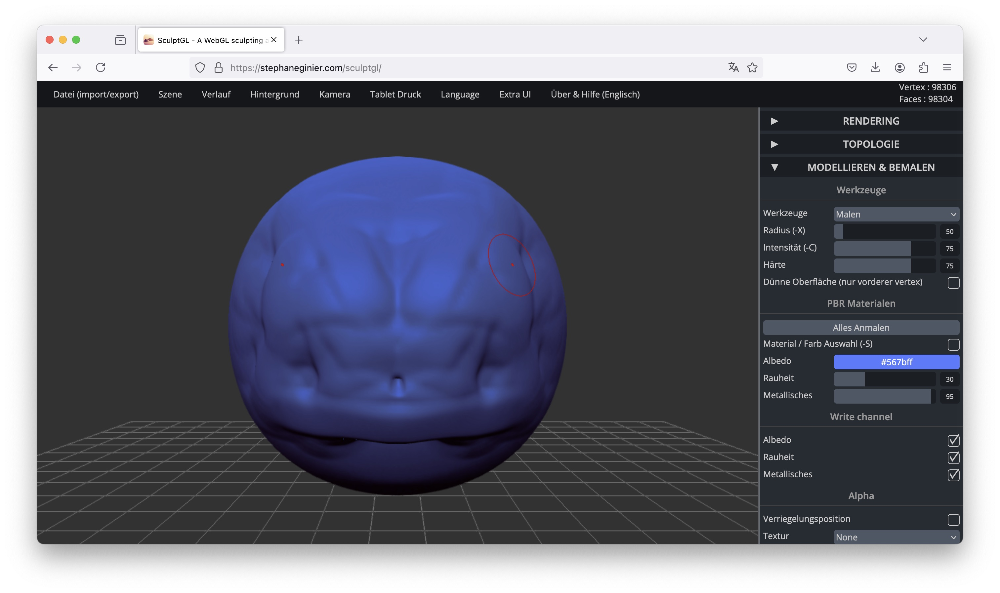

##   Online Sculpting Tools

For quick prototyping and experimentation, online sculpting tools provide a convenient way to create and manipulate 3D models without requiring dedicated 3D modeling software. These tools allow for intuitive, browser-based modeling, making them useful for generating assets that can later be imported into Unity.

### SculptGL 

An  WebGL-based sculpting application that enables users to create and refine 3D models directly in their browser.
[Link](https://stephaneginier.com/sculptgl/)

When using this tool, please set the resolution to 3: 

### MonsterMash

A sketch-based modeling and animation tool that allows users to draw 2D characters, inflate them into 3D models, and animate them.
[Link](https://monstermash.zone/)