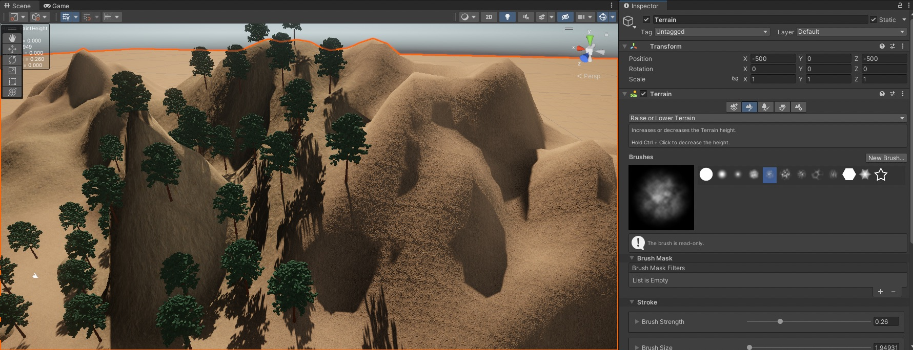
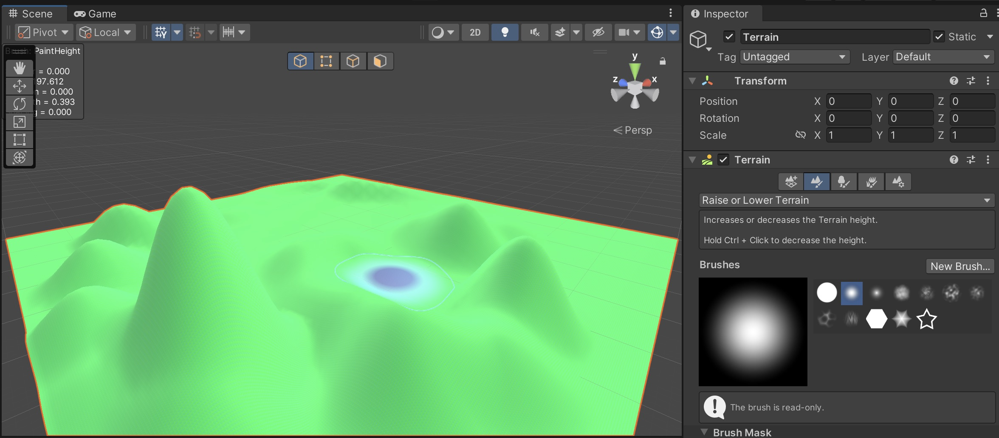
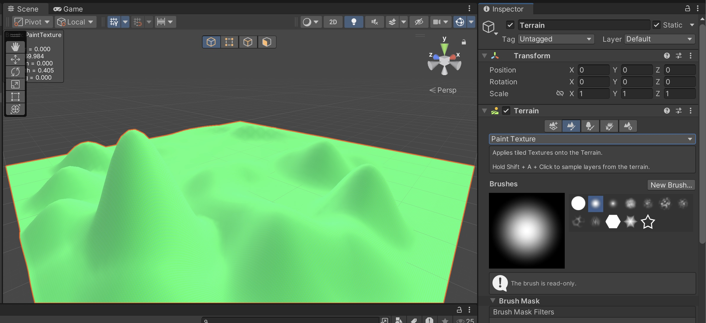
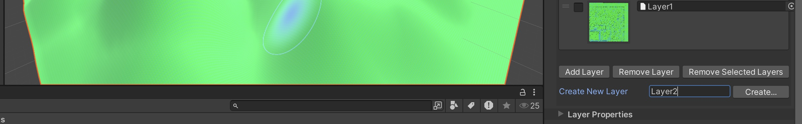
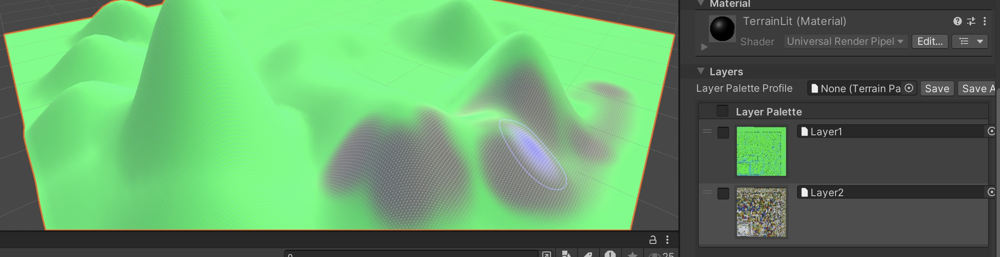

# Session 2: Creating the first 3D Objects

In this section, we explore various methods for creating and importing 3D objects into Unity. Unity offers built-in tools like the Terrain Tool for landscape generation, while online sculpting tools and 3D scanning apps provide additional ways to generate assets. Additionally, AI-based tools enable automatic 3D model creation from text and images, and professional 3D modeling software like Blender allows for complete creative control over asset development.

Each approach serves a different purpose:
- Terrain Tools are ideal for generating landscapes and natural environments.
- Online Sculpting & 3D Scanning Tools offer quick ways to create assets without traditional modeling skills.
- AI Tools automate asset generation, useful for rapid prototyping.
- Advanced 3D Modeling Software provides full control for creating optimized, custom models.

This section provides step-by-step instructions for working with these tools, helping you choose the best approach based on your project needs.

## Create a new Scene

Before you start to create your new 3D Objects, create a new scene with File -> New scene or the shortcut cmd+N (Mac) or Ctrl+N (Windows).

## Terrain Tool  

Unity’s Terrain Tool provides an easy way to create landscapes, shape terrain, and add vegetation, making it a powerful feature for worldbuilding. It allows for height manipulation, texture painting, and vegetation placement within a scene.

**Creating a Terrain**

To add a terrain to your scene:

 - In the Unity menu bar, navigate to:
 - GameObject -> 3D Object -> Terrain
 - A new Terrain GameObject will appear in your scene. This is a large, flat surface that you can modify using terrain sculpting tools.

**Sculpting the Terrain (Raising and Lowering Terrain)**

To shape the landscape by adjusting its height:
- Select the Terrain GameObject in the Hierarchy.
- In the Inspector, open the Terrain component and navigate to the Paint Terrain tab.
- Select Raise or Lower Terrain from the list of tools.
- Choose a brush shape and size.
- Click and drag over the terrain in the Scene View to sculpt mountains, valleys, or hills.

> Tip: Holding Shift while painting will lower the terrain instead of raising it.

**Painting Textures on the Terrain**

To add textures (e.g., grass, sand, rocks) to the terrain:
- Select the Terrain GameObject.
- In the Inspector, go to the Paint Terrain tab and choose Paint Texture.

- Click Create Layer to add a new texture layer.
- Select a texture from your assets or import one from an external source.

- Once added, select the texture layer you want to paint with and apply it to the terrain.

> You can add multiple layers and blend them to create realistic ground surfaces.

> You can find a good tutorial on the Terrain Tool here: [How to build beautiful landscapes in Unity using Terrain Tools | Tutorial](https://www.youtube.com/watch?v=smnLYvF40s4) or have a look at [Unity Documentation Terrain Tool](https://docs.unity3d.com/2022.3/Documentation/Manual/script-Terrain.html)

# Exercise: Sculpt a Terrain in Unity

Goal: Create a natural landscape using Unity's Terrain Tool.

- Create a new Terrain.
- Use the Raise/Lower Terrain tool to sculpt hills, valleys, and flat areas.
- Add at least two textures (e.g., grass, sand, or rocks) using the Paint Texture tool.
- Adjust the Brush Size and Opacity to create natural transitions between textures.

[Go to next section](2_3DScan.md)\
[Back to the overview](readme.md)
