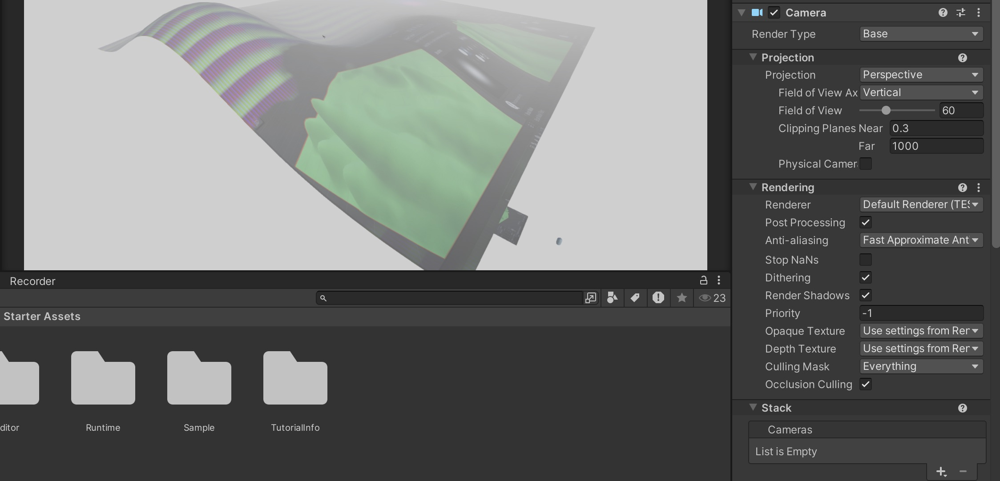
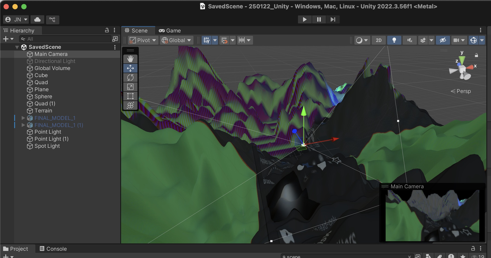
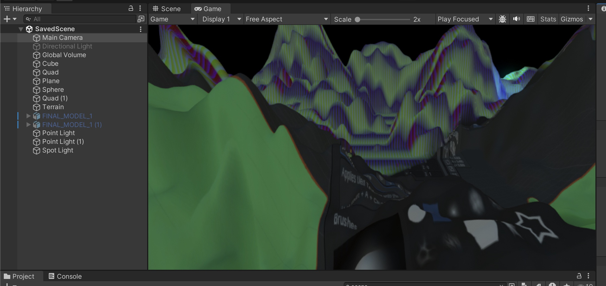
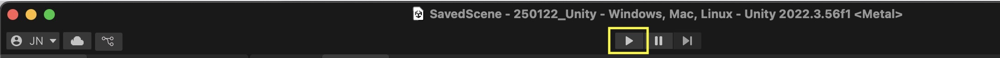

# Camera & The Game Window

## Camera
The Camera in Unity acts as the player’s view into the game world, rendering everything it sees. It defines what is visible on screen, including perspective, depth, and field of view. 

Every Unity scene starts with a Main Camera, which you can find in the Hierarchy panel. You can adjust its properties in the Inspector, such as position, projection type (perspective or orthographic) or the field of view.

When you select the camera in the scene view you can also see the cameras view frustum and a small preview of what the camera sees. 

> When you are in the scene view you can right click on the camera and choose "Align to View", this aligns the camera to your current scene view.

## Game View
The Game View window in Unity shows how your game will look when played. It renders what the Main Camera sees and simulates the final player experience. You can test gameplay, adjust resolutions, and switch between different aspect ratios. The Play, Pause, and Step buttons allow you to run and debug your game in real time. Unlike the Scene View, which is for editing, the Game View provides a preview of the final visuals and interactions. 

When we work with Animations and Audio you can only see and hear the effect with the game running, to do this, click the Play-Button on top of the window: 

> !!! Changes made in Play Mode are not saved, so be sure to stop the game by clicking the Play button again before making any adjustments. !!! 

[Go to next section](3_VisualEffects.md)
[Back to the overview](readme.md)