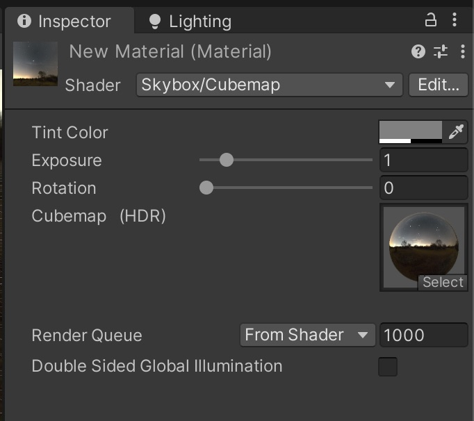

# Session 3: Lighting, Cameras and Visual Effects

In this session, we will explore essential techniques for enhancing the visual presentation of your Unity scene. Proper lighting, camera setup, and visual effects significantly impact the atmosphere, realism, and readability of a game environment.
Topics Covered:

- Lighting the Scene – Understanding different light types, shadows, and how to create depth and mood.
- Camera & Game Window – Adjusting the camera perspective, field of view, and previewing the game as the player would see it.
- Visual Effects & Global Volume – Using post-processing effects to enhance colors, contrast, fog, and other environmental effects.

# Lights

## Realtime Lights 
Realtime lights calculate the lightrays in realtime, that means you can move the lights, move the object that catch shadows from the light without any prerendering. 

You can find them under GameObjects -> Light

There are three types of lights: Spotlight, Pointlight, Directional light. 

#### Spotlight
A Spotlight emits light in a cone shape, illuminating only a specific area in a particular direction. It's ideal for focused lighting, like flashlights, spotlights on a stage, or headlights on a vehicle. You can adjust the cone angle and range to control its spread.

#### Point Light
A Point Light emits light uniformly in all directions from a single point, similar to a light bulb. It's perfect for creating localized illumination, such as a lamp, a torch, or glowing orbs. You can adjust its range to control how far the light reaches.

#### Directional Light
A Directional Light emits light evenly across the entire scene, simulating sunlight or moonlight. It has no specific source position and affects all objects as though light rays are parallel. It's commonly used for outdoor scenes or large-scale environments.

You can also change parameters like intensity, color etc. when you select the light in your scene or in your hierarchy: 

## Shadows 

Shadows in Unity can be adjusted through the Light component.

Select the Light source (Directional Light, Point Light, or Spot Light) in the Hierarchy.

In the Inspector, find the Shadow Type setting.

Choose from the following options:
- No Shadows – Disables shadows for this light.
- Hard Shadows – Creates sharp-edged shadows.
- Soft Shadows – Generates smoother, more realistic shadows.

## Skyboxes 
A Skybox is a panoramic background that surrounds your entire scene, simulating the appearance of a distant environment, such as a sky, stars, or a landscape. It's implemented as a textured sphere or cube that wraps around the scene and serves as both a visual backdrop and a source of ambient lighting. By using a Skybox, you can easily change the atmosphere and lighting of your scene.

To use a skybox go the lighting window (Window -> Rendering -> Lighting) and select the skybox material: 

(Note: You have to click on "Generate Lighting" and your Objects need to be static)

Best places to find skyboxes: 
- [Polyhaven](https://polyhaven.com/hdris)
- [Unity Asset Store](https://assetstore.unity.com/2d/textures-materials/sky)

### Importing a skybox (from Polyhaven)
Download the skybox as .exr (i would recommend 4k resolution, if you wanna see the skybox in the background, if not 1k should be enough). 

Import to Assets, then select the image in the Project Window and go to the inspector and select texture shape -> 

Then create a material (Assets -> Create -> Material) go the inspector and search for "Cubemap" in the shader dropdown. 

Then you can drag and drop the image that you imported in the cubemap area. 

Now you can use the skybox in the lighting settings. 

