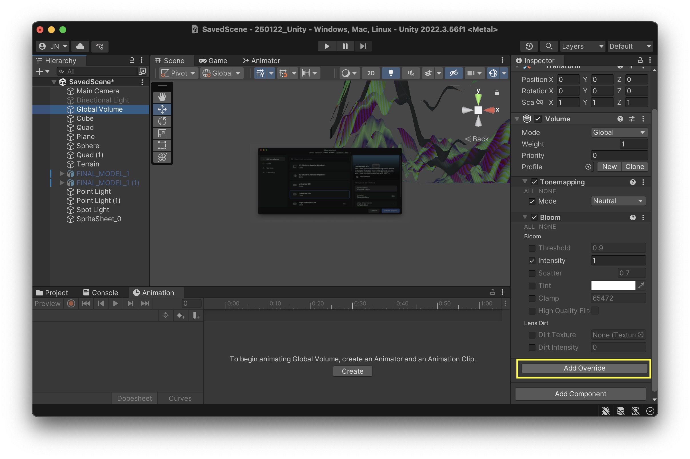

# Visual Effects & Global Volume

The Global Volume in Unity is a component that applies post-processing effects across the entire scene. You can adjust settings like exposure and color adjustments in a Volume Profile to control the overall look of your game. Since it affects the whole scene, it’s useful for setting up consistent visual aesthetics. 

To change the settings select "Global Volume" in your hiearchy, in the inspector you can see the different settings. If you click on "Add Override" you can add effects. 

> If you don't have a Global Volume Game Object in your scene you can add it when you go to: GameObject -> Volume -> Global Volume

Some of the effects are: 
- Chromatic Aberration – Simulates lens distortion by slightly separating colors, creating a fringing effect often seen in real-world camera lenses.
- Color Adjustments – Allows control over brightness, contrast, saturation, and hue to fine-tune the overall color balance of the scene.
- Depth of Field – Blurs objects based on their distance from the camera, mimicking how real cameras focus on specific areas.
- Film Grain – Adds a subtle grainy texture to simulate the look of old film cameras, enhancing a cinematic feel.
- Lens Distortion – Warps the edges of the image to mimic real-life lens imperfections, often used to create a fisheye or wide-angle effect.
- Lift, Gamma, Gain – Provides fine control over color grading by adjusting shadows (lift), midtones (gamma), and highlights (gain).
- Motion Blur – Blurs objects based on their speed and direction, creating a smoother, more dynamic look for fast movements.
- Shadows, Midtones, Highlights – Separately adjusts the brightness and color of different tonal ranges, offering advanced control over lighting and contrast.

> You can find a detailled Tutorial here: [POST PROCESSING in URP (Universal Render Pipeline)](https://www.youtube.com/watch?v=oXNy9mszKxw)

[Go to the exercise for session 3](3_Exercise.md)\
[Back to the overview](readme.md)