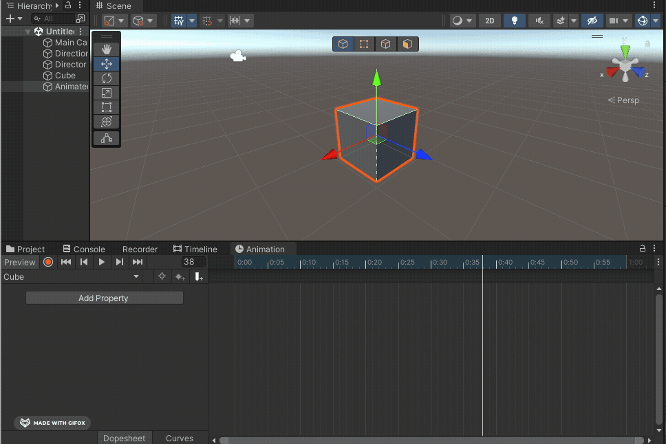
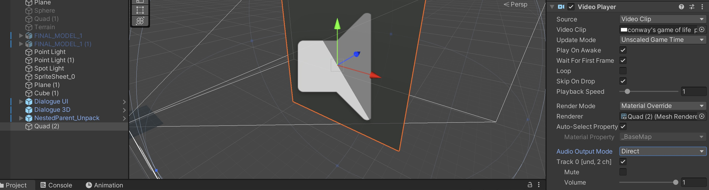

# Animation

Unity’s Animation system allows you to bring objects to life by animating their properties over time using keyframes. The Animation Window is used to create and edit animations by setting keyframes at different points on a timeline.

- Keyframes – Snapshots of a property at a specific time. Unity smoothly transitions between them.
- Animation Clips – A sequence of keyframes that define an animation (e.g., a door opening, a character jumping).
- Animator Component – Controls animation playback on a GameObject.
- Animation Controller – Manages transitions between multiple animations.

What can be animated easily?

Unity allows you to animate nearly any GameObject property, including:
- Transform Properties – Position, rotation, scale (e.g., moving a platform up and down).
- Visibility – Enabling/disabling objects (e.g., making an enemy appear).
- Light Properties – Intensity, color, range (e.g., flickering torch effect).
- Material Properties – Color changes, etc.

What can't be animated easily? 
- The form of the mesh itself, so deforming the mesh. For this, the best way is to rig you figure in the 3D-Software Blender, you can find a tutorial here: [Rigging for impatient people](https://www.youtube.com/watch?v=DDeB4tDVCGY)

## Animations window 

To animate an object, open the "Animation window" (Window -> Animation -> Anmation). 
Then select the GameObject you want to animate in the hierarchy window, now you should see this in the Animation Window: 

Click on "Create" this creates an *Animation Clip*.

Now you can start to animate your object either by hitting the record button:

or by manually adding the properties and keyframes: 

After you have created your Animation click on "Play" to see the animation in your Game View. 

You can animate all sort of properties, for example you can turn on the Video Player Component (or any other component) at a certain time, for this create the animation on the object as shown above and the activate or deactivate the compoment: 

> By default the Animation will loop, if you only want it to play once select the Animation Clip in the Project window and untick "Loop Time" in the Inspector. 

> See also:
- [Tutorial Animation in Unity](https://learn.unity.com/tutorial/working-with-animations-and-animation-curves#)
- You can also create 2D Animations with this system, you can find a detailled Tutorial here: [Introduction to Sprite Animations](https://learn.unity.com/tutorial/introduction-to-sprite-animations#)

[Go to the exercise for session 4](4_Exercise.md) 
[Back to the overview](readme.md)
