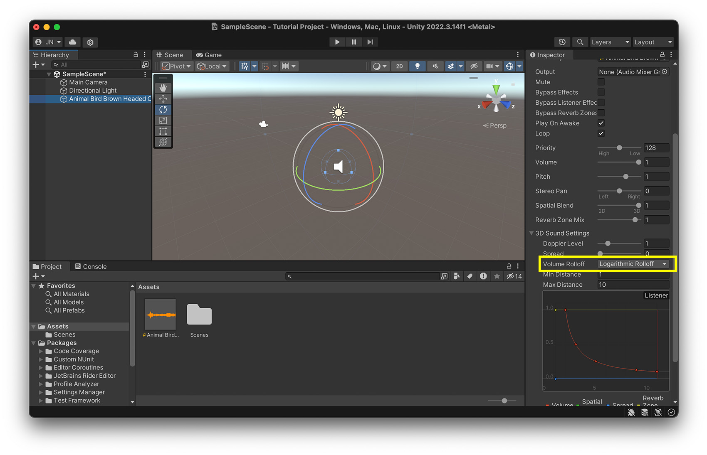

# Session 4: Audio & Video

In this session, we will explore how to integrate audio, video, and animation into your Unity project to enhance interactivity and storytelling. These elements play a crucial role in creating immersive experiences, whether through dynamic soundscapes, cinematic sequences, or animated objects.
Topics Covered:

- Audio – Adding and controlling sound effects, background music, and spatial audio.
- Video – Implementing video playback.
- Animation – Creating and managing simple object animations using Unity’s Animator system.

# Audio 

To add sound to a scene we first need to import our audio file, we can do this by dragging and dropping the audio file in the project window. 

The supported file formats are: 
- AIFF 
- WAV 
- MP3
- Ogg 

Places to get (free) sounds: 
- [Adobe Creative Cloud](https://www.adobe.com/products/audition/offers/AdobeAuditionDLCSFX.html)
- [Unity Asset Store](https://assetstore.unity.com/?category=audio&free=true&orderBy=1)
- [freesounds.org](https://freesound.org/people/Nox_Sound/)
- [OpenGameArt](https://opengameart.org/art-search-advanced?field_art_type_tid%5B%5D=13)
- [Soundcloud](https://soundcloud.com/)

Then we can create a new GameObject with acts as a Audio Source in the scene. 
For this go to: GameObject -> Audio -> Audio Source. 
Then select the created Audio Source in the hiearchy and assign the imported AudioClip. 

Or drag and drop your soundfile in the Sceneview. 

When you select your Audio Source in the Hiearchy you can change the setting of the audio file:

The most relevant for us are: 
- AudioClip: The assigned sound file.
- Mute: If checked, the sound will be silent.
- Play On Awake: Checked, meaning the sound plays automatically when the scene starts.
- Loop: If checked, the sound will repeat indefinitely (currently off).
- Volume: Set to 1 (maximum loudness).

> Here you can find a more in depth tutorial [Tutorial: Sound Component in Unity](https://learn.unity.com/tutorial/working-with-audio-components-2019-3)

## Spatial Audio

Spatial audio in Unity simulates how sounds change based on their position relative to the listener, creating a more immersive experience. It takes into account distance, direction, and environmental effects to make sounds feel like they are coming from specific locations in 3D space.

### Audio Listener & Audio Sources

- The Audio Listener component, usually attached to the Main Camera, represents the player's "ears" and determines how sound is perceived in the scene. Only one Audio Listener should be active at a time.
- Audio Sources are attached to GameObjects that produce sound. They determine volume, pitch, spatial blend, and 3D positioning of the audio.

With "Min Distance" and "Max Distance" you can set the minimum and maximum distance of audibility. 

With the "Volume Rolloff" you can select different Rolloff algorithms. Select "Linear Rolloff" if you want to hear a strong difference based on the positioning, "Logarithmic Rolloff" for a more realistic effect. 

[Go to next section](4_Video.md)\
[Back to the overview](readme.md)

