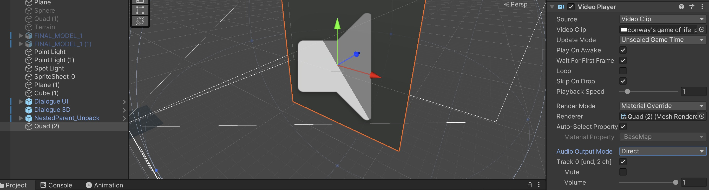
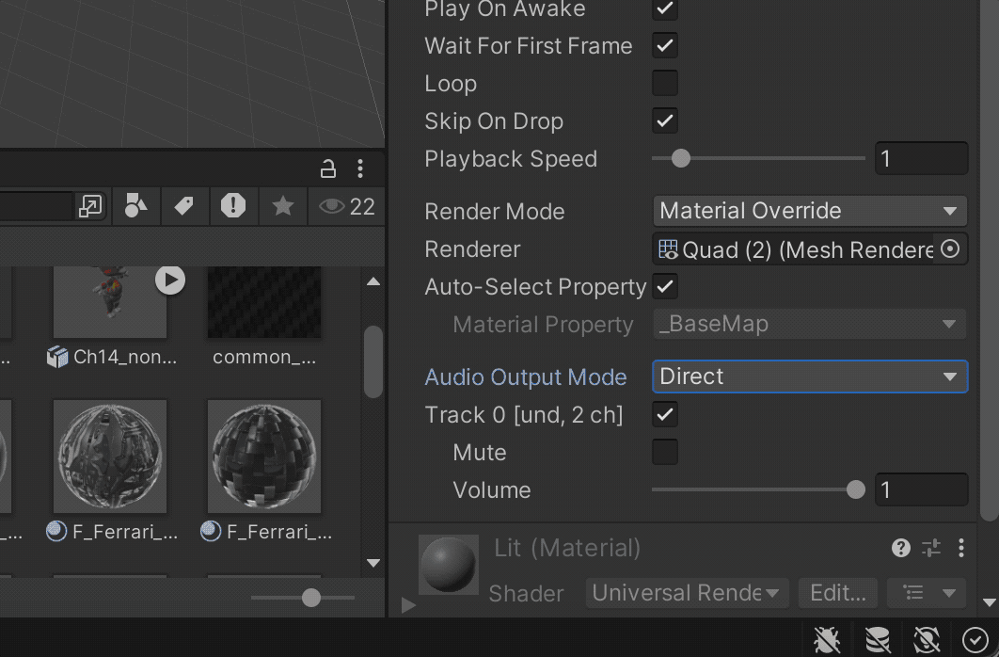

# Video 

Unity can handle a variety of video format for playback in the scene, you can find the list here: [file format Unity Video](https://docs.unity3d.com/Manual/VideoSources-FileCompatibility.html). In my experience the H264 format in the .mp4 container works best. 

Importing videos is straightforward: just drag and drop them in your project window, like all other assets. 

To render the video in the world space you need a "virtual screen", for example a Quad that you position in your scene. You can then drag and drop your video on the squad and Untiy will add the Video Player component automatically. 
Its best to scale the Quad according to your video aspect ratio (so for example if you have a FullHD-Video, scale the Quad 16x9m), otherwise the video will be distorted. 

When you select the GameObject with the video attached you can change settings like whether the video loops, the playback speed or the volume.

> By default the sound of the video plays directly over your speakers. To get more control you change the Audio Output Mode to "Audio Source" and add a Audio Source: . Then you can set the same settings as we have seen in the Audio section before. 

> There are also other option to display videos in Unity, for example in Full Screen, here you can find a good and quick overview video: [Play Video In Unity (2D, 3D, UI canvas, Full screen)](https://www.youtube.com/watch?v=5nPRYwCceTg)

[Go to next section](4_Animation.md)
[Back to the overview](readme.md)

