# Characters and Dialogues

In this session, we will focus on implementing characters and dialogue systems in Unity. Characters play a central role in interactive experiences, and dialogue systems enable storytelling, player interaction, and narrative progression.
Topics Covered:

- Characters – Importing, animating, and setting up character controllers.
- Dialogue System – Creating interactive conversations using text-based systems and logic.

# Character

First we will implement a character that can walk through the scene controlled by our mouse and keyboard input. We will work with the third-person-perspective, but first person would also be possible. A first-person perspective lets the player experience the game through the character’s eyes, with the camera positioned as if they are seeing directly from their head. This is creating an immersive but limited field of view. A third-person perspective shows the character from behind or at an angle, allowing the player to see their full body while moving providing better spatial awareness.

For the implemtation we will use this plugin from the Unity Asset Store: https://assetstore.unity.com/packages/essentials/starter-assets-character-controllers-urp-267961 

> The Unity Asset Store is an online marketplace where developers can find and purchase assets to use in their Unity projects. It offers a wide range of resources, including 3D models, textures, animations, scripts, sound effects, and complete game templates. Both free and paid assets are available. 

To install the asset, sign in with your Unity Account and click on "Add to my Assets". 

Afterwards click on "Open in Unity", in Unity click on Download and then Import. 
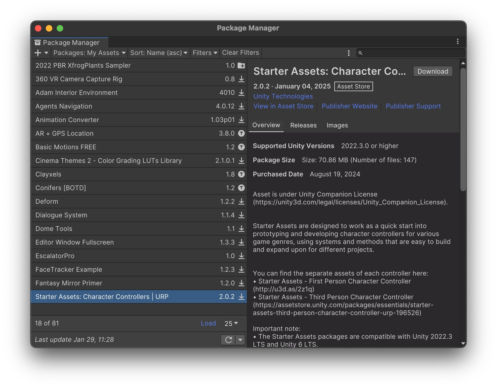
Unity will now ask you whether you want to install the dependencies, click on "Install/Upgrade" and after that click on "Yes" when it asks you about the new Input System this will restart your Unity Editor. 
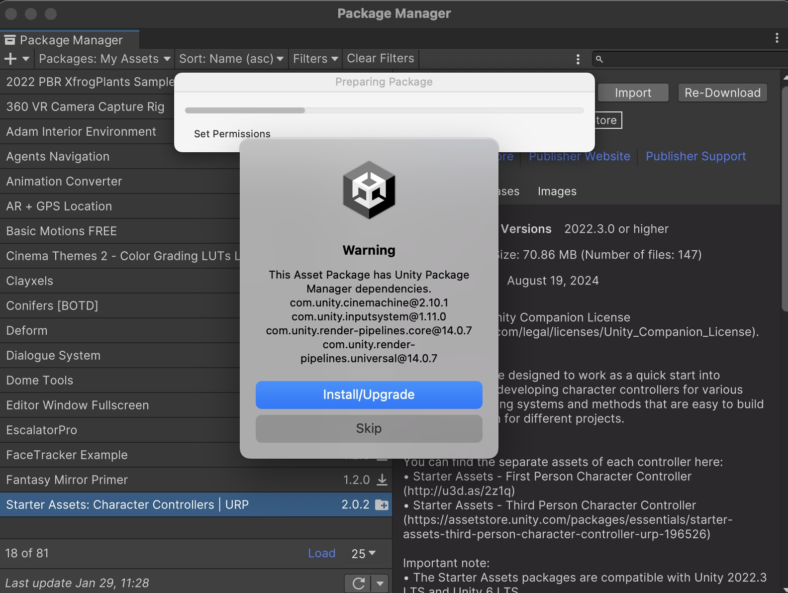

Now we have to import the package, open the Package Manager (Window -> Package Manager), select "My Assets" and search for "Starter Assets: Character Controllers".

Now you should see a folder "Starter Assets" in your project window. In this folder go to Runtime -> ThirdPersonController -> Prefabs and drag and drop the "NestedParentArmature_Unpack.prefab" in your scene and adjust the position. 
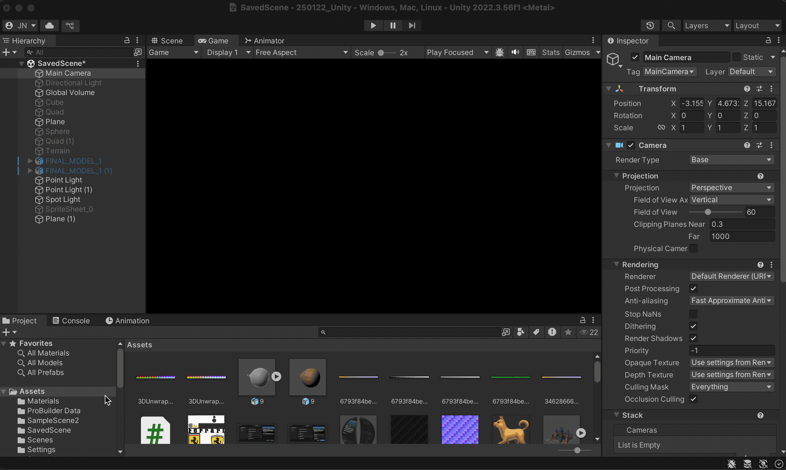

> Prefabs in Unity are reusable GameObjects that store a predefined configuration, including components, properties, and child objects.

Now deactivate your Main Camera, since the Prefab already has a camera. 
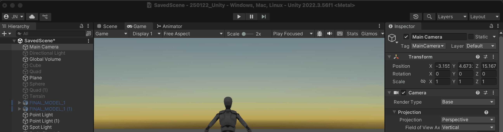

When you now click Play, you should be able to control the Character with your keyboard and mouse. 
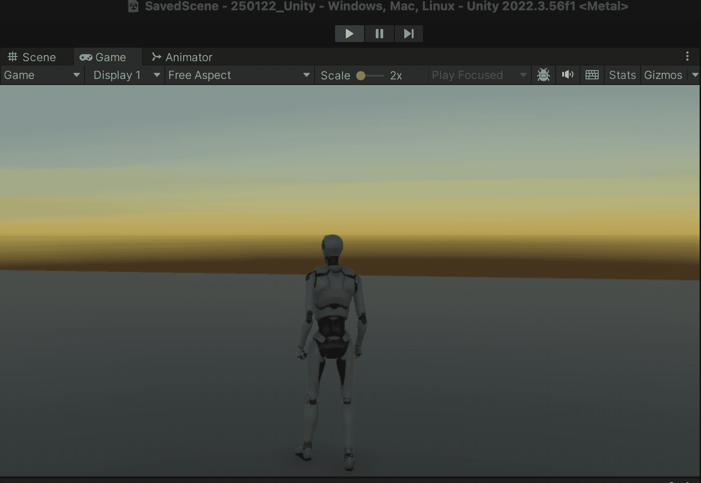

## Changing the character 

If you want to change the character, you have to options: 
	- choose another humanoid character (e.g. from Mixamo)
	- use another 3D Model, which is not animated (note: you can also animate this in theory, but we won't cover this in this course)

### Choose another humanoid character

You can find a lot of free to use characters at [Mixamo](https://www.mixamo.com), you can also create your own scanned character e.g. with [Avaturn](https://avaturn.me/) or [in3D](https://in3d.io/) (unfortunately not for free). 

For this course we will use Mixamo, so login and go to the characters tab and select a character. 
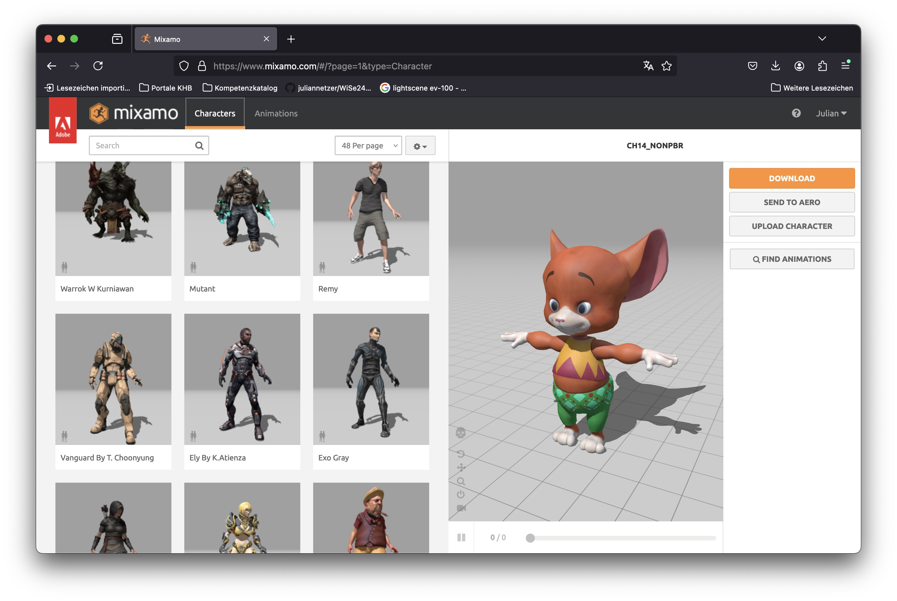

And download them in T-Pose as a fbx for Unity:
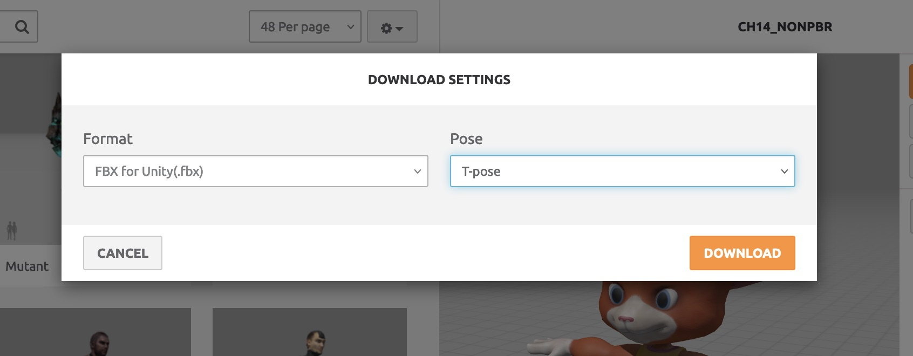

Then import the .fbx to Unity and select the file in the Project window. We first fix the textures like this: 
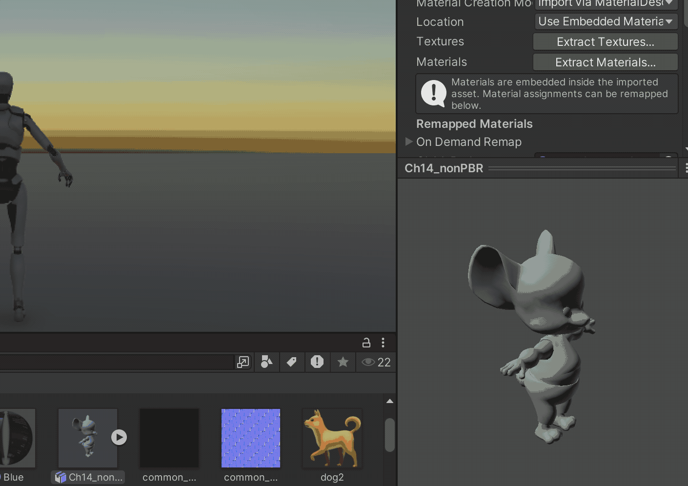

And then import the rig (the movable bones) like this: 
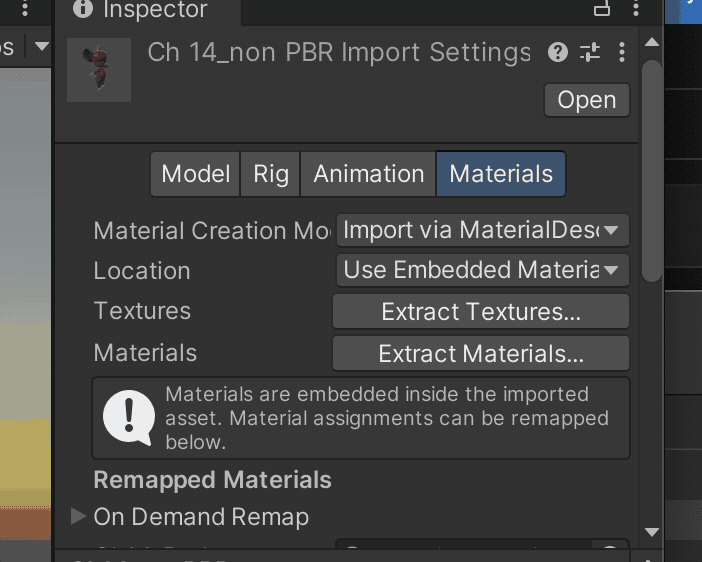

Now we can change the Avatar, in the scene for this go to the NestedParentArmature_Unpack Prefab in the scene and show the child-objects with clicking on the arrow on the left side. And also show the child-objects of PlayerArmature:

> Child Objects in Unity are GameObjects that are hierarchically linked to another GameObject, called the Parent. When a Parent Object moves, rotates, or scales, its Child Objects inherit those transformations.

Then make the imported .fbx-file a child object (drag and drop it into the hierarchy) of PlayerArmature and deactivate the old Avatar with deactivating "Geometry" and "Skeleton"
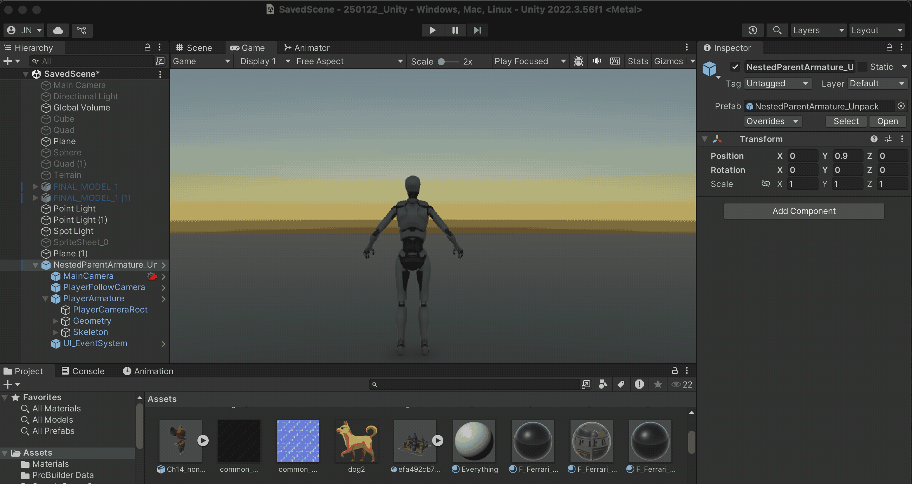

The last step is to select the PlayerArmature Object and change the Avatar to the current Avatar (the Object with the same name as your imported .fbx). 
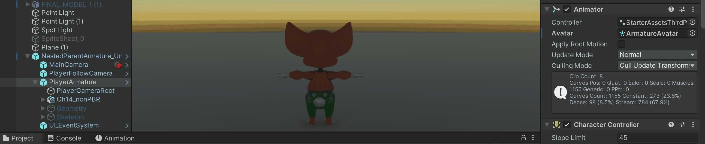

### Choose another 3D Model 

To choose another 3D Model as a character, we first need to delete the old prefab which uses a humanoid rig. So select "NestedParentArmature_Unpack" in the hierachy and select "Delete" after a right click. 

Then we can import our new rig, you can find it under StarterAssets -> Runtime -> ThirdPersonController -> Prefabs -> NestedParentCapsule_Unpack. Drag and Drop this in your hierarchy or scene and position it correctly. 

Now we have a capsule moving in the same way as the humanoid character before: 
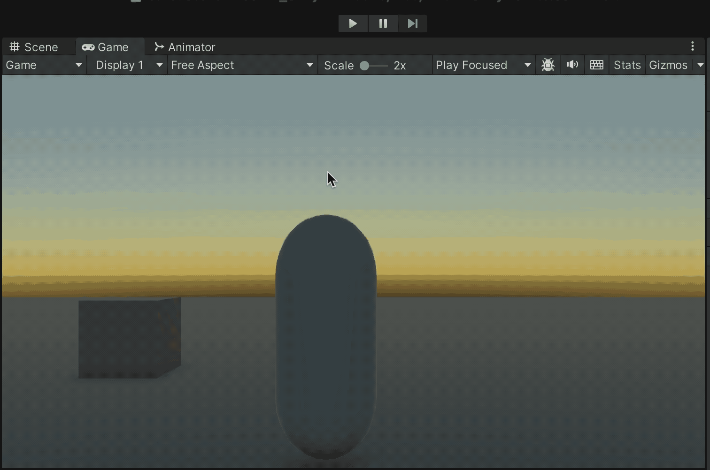

Now we can change the Model in a similar way, open the Prefab again and deactivate the "Capsule"-object: 
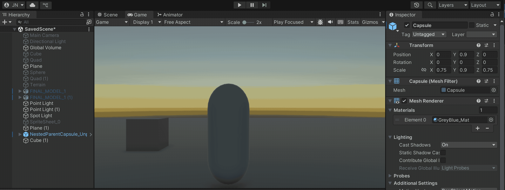

Then drag and drop the Object you want to use as a Character in the hiearchy directly beneath the "Capsule"-object and position and scale it accordingly: 
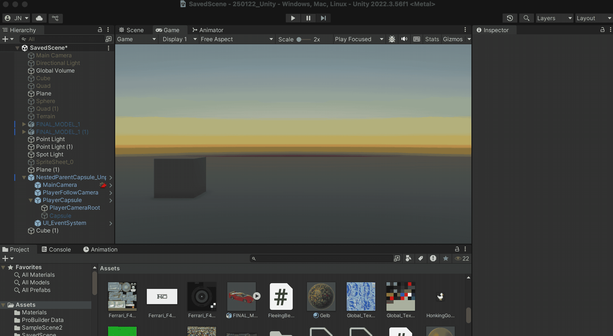

Now you can move around with you 3D-Object as a Avatar/Character in your scene: 
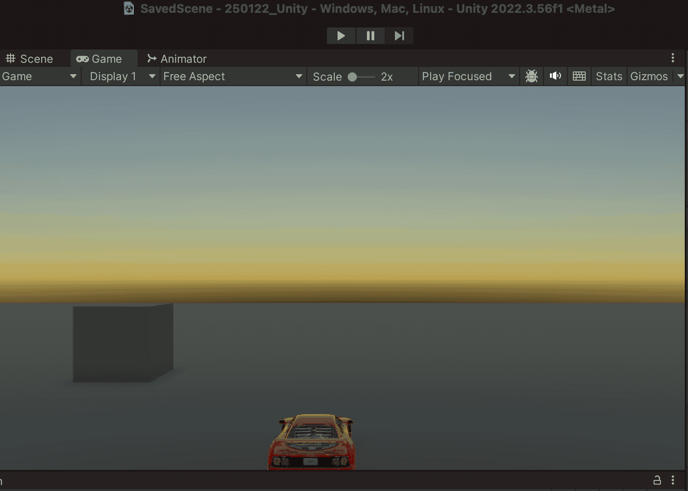

## First Person Controller 

To use a first person controller, you can use the FirstPersonController-Prefab, you can find it under: Starter Assets -> Runtime -> FirstPersonController -> Prefabs -> NestedParent_Unpack. Drag and Drop in your Scene hierarchy and change the position according to your scene. 
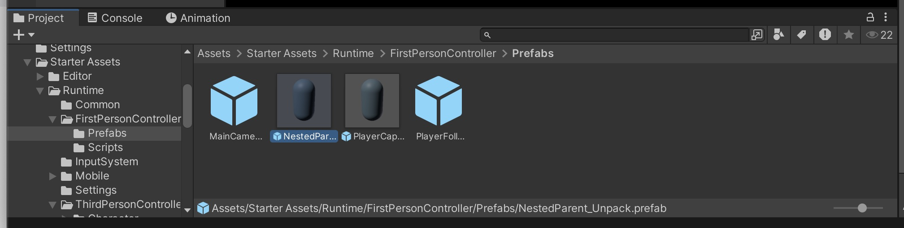

### Changing Camera perspective

You can also change the camera perspective in your third & first person controller, like the height or the distance to the Avatar. 

To do this open the Prefab and search for a object called "PlayerFollowCamera", in the inspector you can now find different parameters to change: 
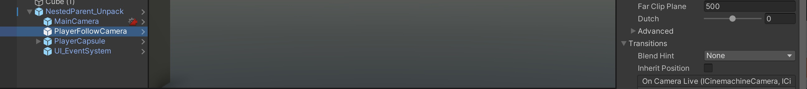

- Vertical FOV, the Field of View of the Character or Camera 
- In the "Body" section you can change the positioning: 
	- change the height, distance and in general the position with the Shoulder Rig Offset parameters
- in the "Noise" section you can add different forms on noise applied to the camera, the default setting is the noise of a handheld camera. 
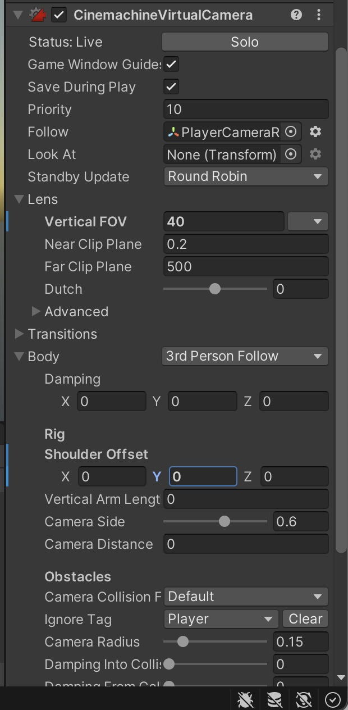

[Go to next section](5_DialogueSystem.md)
[Back to the overview](readme.md)

