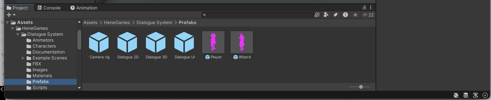
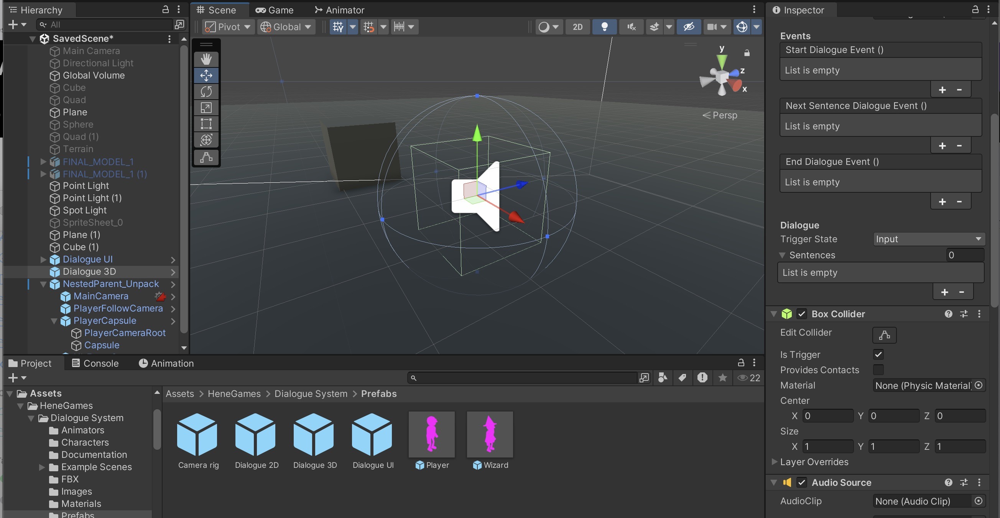
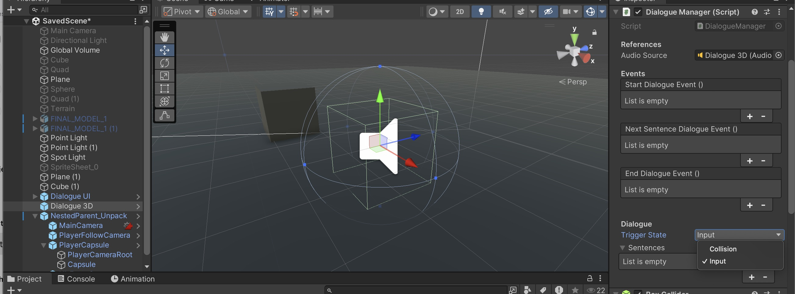
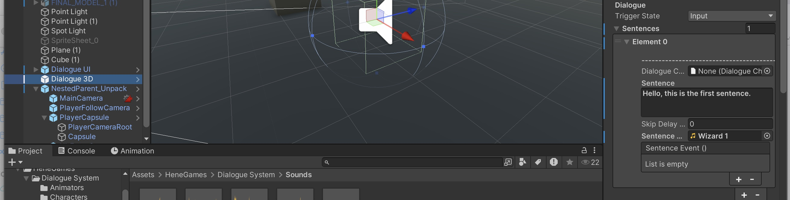
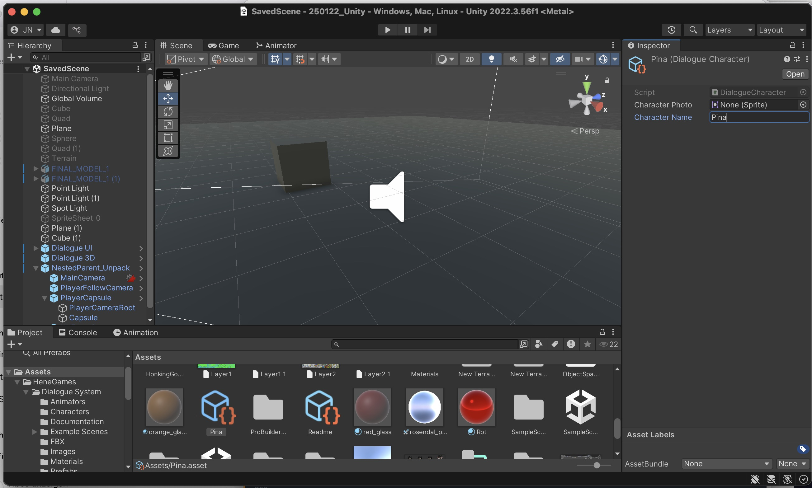
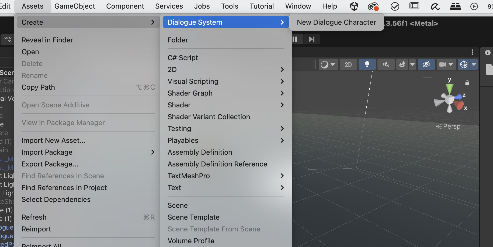
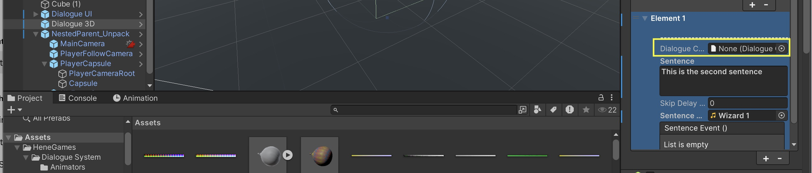
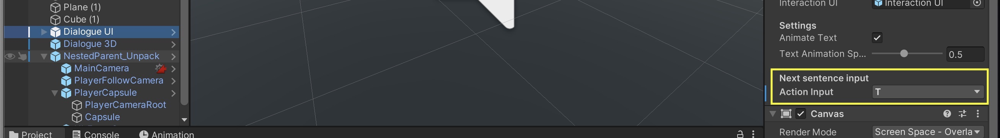
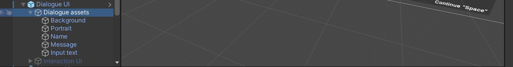

# Dialogue System 

Next we will create a simple dialogue system. Simple means, that you can only go to through a list of sentences and not choose different answer options. 

For this we will use the Dialogue System Plugin from HeneGames: [Dialogue System in the Asset Store](https://assetstore.unity.com/packages/tools/gui/dialogue-system-248969)

Just like when installing the Controller Asset before, click on "Add to my Assets" and then "Open in Unity". In the Unity package manager click on "Download" and "Import".

After importing, you should see a Folder called "HeneGames" in your Project window. In the folder go to Dialogue System -> Prefabs, here you can find all the necessary prefabs. 

## Creating the first dialogue

We first need to include the User Interface, for this drag and drop the "Dialogue UI" from the Prefabs-Folder in your hierachy.

Next we can create the object with which the character should interact, for this we drag and drop the "Dialogue 3D"-Prefab from the Prefabs-Folder in the scene. 

This is the object which triggers the dialogue system, when the character enters, so you can place this where you want the dialogue to start. 
When you select the Dialogue 3D-GameObject you can see a green box around it in the scene view, this marks the area when the dialogues starts when the characters comes near: 

You can change this size in the Box collider size section. 

> A Collider in Unity is a component that defines the physical shape of a GameObject for collision detection. It allows objects to interact with each other by detecting overlaps and preventing them from passing through one another. Colliders can be basic shapes (Box, Sphere, Capsule) for efficiency or Mesh Colliders for detailed accuracy. When combined with a Rigidbody, colliders enable physics-based interactions, such as bouncing, sliding, or triggering events.

With the trigger state you can change whether the dialogue starts when the characters just enters the collider or whether the player has to press a key first: 

In the sentences section you can now add your dialogue sentences. You can also add some audio files which will be played when the dialogue is visible. 

> You can also activate certain events when a dialogue is played (in the Sentence Event () field) or also when the dialogue starts or end (Start Dialogue Event()).

## Creating Dialogue Characters

You can display a character's name when the dialogue is activated.

To create a new character in the plugin, navigate to Assets → Create → Dialogue Systems → New Dialogue Character. 

This will generate a new asset, which you can rename in the Inspector.

Next, go to Dialogue 3D and drag and drop the created asset into the Dialogue Character field to assign it.

## Changing the behaviour and look of the dialogue system 

When you select the Dialogue UI GameObject in your hiearchy you can change the look and some of the behaviour of the dialogue system. 

E.g. you can change the key to trigger the dialogue and go to the next sentence: 

To change the look of the dialogue window open the Dialogue assets GameObject, here you can find all of the elements you can then deactivate the ones you don't need (e.g. the portrait), resize them, change the color etc. 

> You can find a tutorial how to work with the UI system in Unity here: https://medium.com/coinmonks/introduction-to-ui-elements-in-unity3d-b2c8701e378b#a3cf

> To change the font you need to import your font first, for this you can find a tutorial here: https://docs.unity3d.com/Packages/com.unity.textmeshpro@4.0/manual/FontAssetsCreator.html

