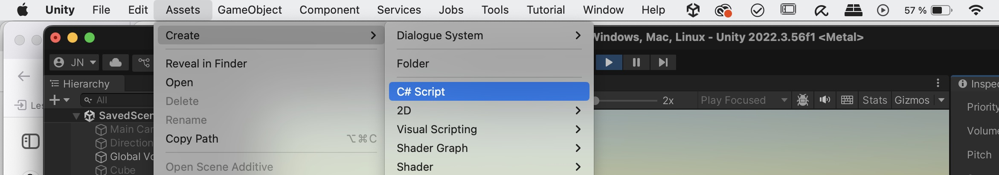
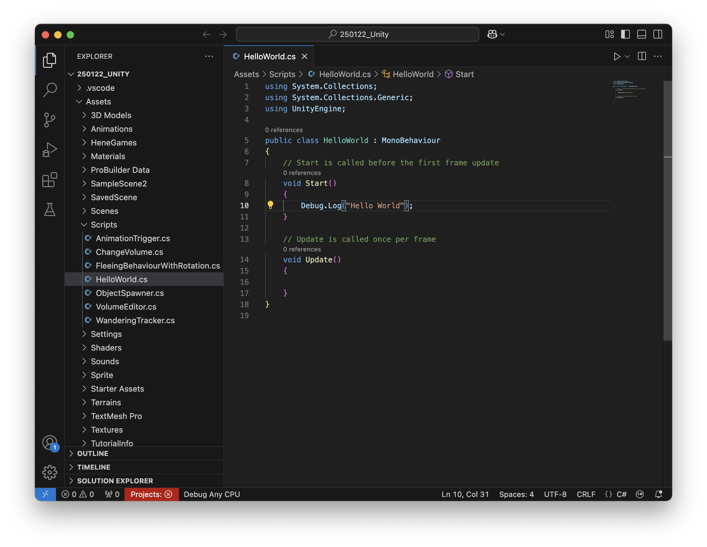
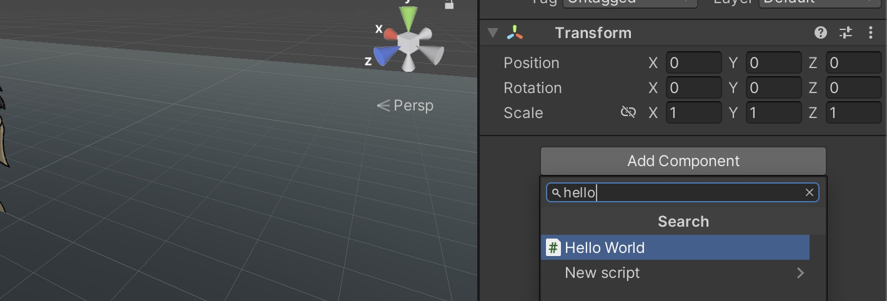
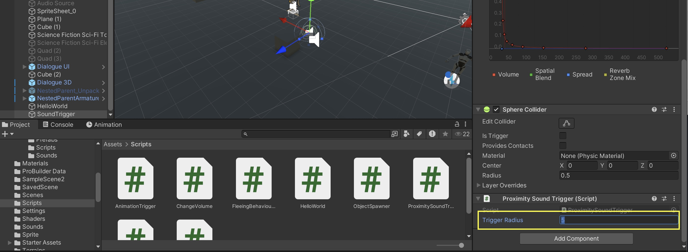
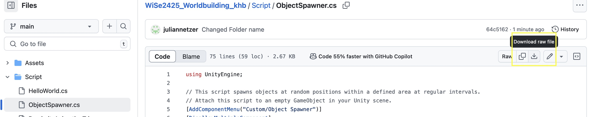

# Interaction and Coding in Unity 

This session introduces coding in Unity to create interactive experiences. While Unity provides many built-in tools, scripting with C# allows for greater control over game mechanics, interactions, and automation.

Topics Covered:

- Coding in Unity – Setting up and writing scripts to control behavior.
- Using AI Tools (ChatGPT & Claude) – Assisting in coding and debugging.
- Example Code Snippets – Practical examples for common Unity tasks.

By the end of this session, you will have a basic understanding of scripting in Unity, enabling you to add dynamic interactions to your project.

# Coding in Unity 

In Unity, scripts with the programming language C# are used to control the behavior of GameObjects. Scripts interact with objects by modifying their properties, responding to player input, or handling game logic. Each script is typically attached to a GameObject as a component, allowing it to influence that object.

A script is a asset saved as a .cs-File 

A basic Unity script looks like this:
```
using UnityEngine; //imports whats needed for the script to run, in this case the basic Unity Engine

public class ExampleScript : MonoBehaviour //Name of the Script (must be the same as the filename)
{
    void Start()
    {
        // Runs once when the GameObject is first activated
    }

    void Update()
    {
        // Runs every frame, useful for movement or checking inputs
    }
}
```

> when you write // in your code you can write comments afterwards, this is useful to explain this, or to remember what certain code blocks are for

## Functions

A function (also called a method) in Unity is a block of code that performs a specific task. Functions help organize code, making it reusable and easier to manage. In Unity, functions are often used to control GameObjects, handle player input, or execute game logic.
Structure of a Function

A function in C# consists of:
- Return Type – Defines what the function returns (e.g., void for no return, int for numbers).
- Function Name – The identifier used to call the function.
- Parameters (Optional) – Data passed into the function.
- Code Block – The actual instructions inside { }.

Example:
```
void Start()
    {
        Debug.Log("Hello World");// Runs once when the GameObject is first activated, this writes "Hello World" in the console.
    }
```

## Variables

Variables are like storage boxes that hold data (values).

- int – Stores whole numbers (e.g., int score = 10;).
- float – Stores decimal numbers (e.g., float speed = 5.5f;).
- bool – Stores true or false (e.g., bool isJumping = false;).
- string – Stores text (e.g., string playerName = "Alex";).
- GameObject / Transform / Rigidbody – Stores references to Unity objects.

## Control Structures 

### Conditionals

These allow the program to make decisions. 

Example:
```
if (health < 20) {
    Debug.Log("Warning: Low health!");
} else {
    Debug.Log("Health is good.");
}
```

## Examples how scripts interact with GameObjects

#### Access Components – Scripts can modify an object's Transform, Audio Source, Rigidbody, Collider, or any other component.
```
GetComponent<AudioSource>().volume = 0;
```

#### Modify Object Properties – Change position, scale, color, or any other attribute.
```
transform.position = new Vector3(0, 2, 0);
```
#### Handle Player Input – Detect key presses, mouse clicks, or controller inputs.
```
    if (Input.GetKeyDown(KeyCode.Space))
    {
        Debug.Log("Jump!");
    }
```

## <a name="newscript"></a>Creating a new script

To create a script select Assets -> Create -> C# Script and select a name (please use a name that describes the function in our case "HelloWorld"). 


Then double click on the script in the project window, this should open Visual Studio Code with the script opened: 


Now we can copy & paste our code: 
```
using UnityEngine;

public class HelloWorld : MonoBehaviour
{

    void Start()
    {
        Debug.Log("Hello World!");
    }
}
```

In Unity, a script needs to be attached to a GameObject to function properly because of how Unity’s architecture is designed. Unity follows a component-based architecture, where behaviors and properties are added to GameObjects through components—and scripts are one of those components.

So we will create an empty GameObject called "HelloWorld", for this go to GameObject -> Create Empty.

When we created the GameObject we can either drag and drop our script on the GameObject or we can select the GameObject and click on "Add Component" and search for our "Hello World"-Script: 


Then we can start the Play Mode and should now see a "Hello World" in the console window: 


> Debug.Log() is a function in Unity used to print messages to the Console window. It helps you track what’s happening in your code—like checking variable values, confirming if certain code runs, or identifying errors.

> The Console window in Unity displays: Log messages (from Debug.Log), Warnings (highlighted in yellow), Errors (highlighted in red). You can find it by going to Window → General → Console. It's useful for: See if your code is running as expected or to find out where bugs or errors are happening.

## Public Variables & Unity Editor

For the next example we will use a more advanced script, that starts to play an audio file, when the player (or another GameObject) comes near. In this example we will also work with public variables. Variables declared as public can be edited directly in the Inspector without modifying the script. This makes tweaking values easier without needing to recompile the code. You can also make a public GameObject variable to edit other GameObjects in your scene. 

So again create a new C# script and name it "ProximitySoundTrigger", then copy and paste the following code:

Example Script: 

```
using UnityEngine;

[RequireComponent(typeof(AudioSource))]
[RequireComponent(typeof(SphereCollider))]
public class ProximitySoundTrigger : MonoBehaviour
{
    [Tooltip("Radius within which the sound will be triggered")]
    public float triggerRadius = 5f;
    
    private AudioSource audioSource;
    private SphereCollider triggerCollider;
    private bool hasPlayed = false;

    private void Awake()
    {
        // Get or add required components
        audioSource = GetComponent<AudioSource>();
        triggerCollider = GetComponent<SphereCollider>();
        
        // Configure the collider
        triggerCollider.isTrigger = true;
        triggerCollider.radius = triggerRadius;
        
        // Configure the audio source to not play on awake
        audioSource.playOnAwake = false;
    }

    private void OnValidate()
    {
        // Update collider radius when changed in inspector
        if (triggerCollider != null)
        {
            triggerCollider.radius = triggerRadius;
        }
    }

    private void OnTriggerEnter(Collider other)
    {
        // Play sound if it hasn't played yet
        if (!hasPlayed)
        {
            audioSource.Play();
            hasPlayed = true;
        }
    }

    private void OnTriggerExit(Collider other)
    {
        // Reset the played flag when object exits the trigger
        hasPlayed = false;
    }
}
```

Then again create a new GameObject in your scene and add the script. When you add the script it automatically adds a collider and an Audio Source to the GameObject. 
It also adds the possibilty to change the radius of the collider directly via the inspector: 


Then add a sound to the Audio source that gets played when the character (or another object with a collider) is near. 

> You can also find the script here: [link to script](Script/ProximitySoundTrigger.cs).
>  To import the script go to "Download raw file" and then drag and drop in your Unity project window. 


[Go to next section](6_AICoding.md)<br>
[Back to the overview](readme.md)