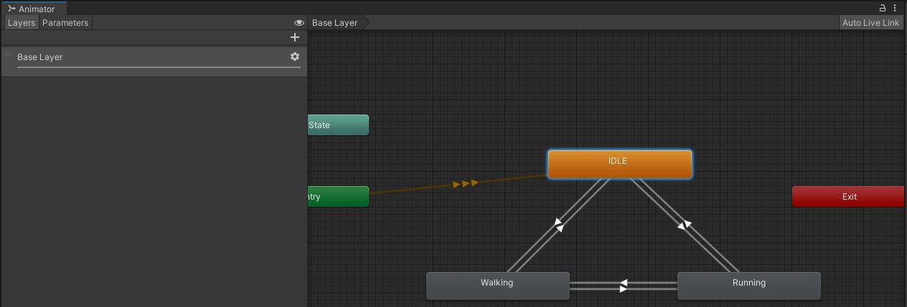

# Coding Examples

In the following you can find a few example with instruction how to use them. You can just use these in your projects or modify them with the LLMs for your needs. 

## Randomly place objects in the scene

This script randomly places Prefabs in your scene, you have the following public values: 

You can also hover over the variables to see what each of them does: 

Download the script here: [link to script](Script/ObjectSpawner.cs)

### How to Create Prefabs in Unity
For this example you need a Prefab that gets spawned in the scene. A Prefab in Unity is a reusable GameObject template that allows you to create multiple instances with the same properties. Here’s how to create one:

1. Create a GameObject: In the Hierarchy, right-click and choose 3D Object > Cube (or any other object) (or use an imported 3D model). Customize it by adjusting its transform, adding components, or applying materials.

2. Make the Prefab: Drag the GameObject from the Hierarchy into the Project window. This creates a Prefab asset (indicated by a blue cube icon).

3. Use the Prefab: Drag the Prefab from the Project window back into the Hierarchy to create instances. Changes made to the Prefab asset will apply to all its instances unless overridden.

4. Edit the Prefab: Double-click the Prefab in the Project window to open Prefab Mode for editing. Press the arrow icon next to the instance to modify it directly in the scene.

### How to use gravity 

To use gravity like in the example above, add the following components to your GameObject: 

#### RigidBody
To make objects fall down in Unity, you'll need to apply physics to them. This is typically done by adding a Rigidbody component, which allows Unity's physics engine to simulate gravity and other forces on the object.

Add a Rigidbody Component:

1. Select the object in the Hierarchy.
2. In the Inspector window, click Add Component.
3. Search for Rigidbody and add it.

#### Collider
When You Do Need a Collider:

- To make the object land on the ground, walls, or other objects.
- To detect hits in scripts (using OnCollisionEnter, OnTriggerEnter, etc.).

How to Add a Collider:

1. Select the object.
2. Click Add Component > search for Collider:
    - 3D Objects: Use Box Collider, Sphere Collider, or Mesh Collider.
    - 2D Objects: Use BoxCollider2D, CircleCollider2D, etc.
3. Adjust the collider size in the Inspector if needed.

## Change animations when the player or another object comes near

Download the script here: [link to script](Script/ProximityAnimationTrigger.cs)

### Creating multiple animations for one GameObject
In the following example we will use a script to change the animation when a player comes near.
To create multiple animations the object, select the GameObject you want to animate and click on the drop-down menu. 
Select "Create new Clip" and create your animation.

### Animator window

In the Animator window (Window -> Animation -> Animator) you can see all of the animations created for the GameObject. The Animator component selects which of your animation clips will be played. For example when you want to create a Character that has different states (like walking, standing, running) and one animation clip for each state you would animate this in the Animator window (in general: non-linear animations). 

### Adding the script 
Download the script here: [link to script](Script/ProximityAnimationTrigger.cs)

Then add it to the GameObject, when you hover over the names of the variables you can see what they do. 

### <a href="Tags">Tags</a> 

The Script has a field called "Target Tag", this makes sure that only certain objects can trigger the animation change. So you have to make sure that your character/object has the right tag. You can choose the names of the tags, just make sure you recognize them again. 
To add a Tag to an object select the object and click on Tag in the inspector, click on "Add Tag" to create your own Tag. 

## Wandering Around

With this script you can make a GameObject wander around randomly in your scene. 

> This script only works with simple GameObject, not with more complex ones like characters with animations. If you want pair it with the Third Person Controller try to use ChatGPT or Claude to generate the Code, you can take this script as a starting point. 

Download the script here: [link to script](Script/SimpleWanderer.cs)

### Wandering 
- Move in random directions
- Change direction every 2 seconds
- Use random speeds between 0.5 and maxSpeed
- Smoothly rotate to face the direction of movement
- Work with both Rigidbody and non-Rigidbody objects

### To use this script:

1. Attach it to your GameObject
2. Optionally add a Rigidbody and a collider if you want physics-based movement
3. Adjust the maxSpeed value in the inspector to control how fast the object can move

## Wandering around and looking for something

Download the script here: [link to script](Script/WanderingTracker.cs)

This script creates an object that can wander around and track/follow specific targets in Unity. 

It has to behaviours implemented: 
1. Wandering Behavior
- Moves randomly when not tracking a target
- Changes direction every 2 seconds
- Uses variable speeds up to a maximum speed
2. Target Tracking:
- Detects objects with a specific tag within a set radius
- Follows detected targets until reaching them
- Has a detection range (green visualization sphere)
- Has a "reached target" range (blue visualization sphere)

### How to use

#### Setting up the Wanderer

1. Create a GameObject in Unity
2. Add this script to the GameObject
3. Configure in Inspector:
    - Max Speed: Maximum movement speed
    - Track Distance: How far it can detect targets
    - Reached Distance: How close it needs to get to count as "reached"
    - Tracked Tag: The tag to look for (e.g., "Target").
    - Detection Layer: Which layers to check for targets
    - Rest Time: How long to pause after reaching a target
    - Wander Cooldown: Time to wander before searching for new targets
4. Optional: Add a Rigidbody and a collider for physics-based movement

#### Setting up the Target 

1. Select or create the object you want to be tracked
2. In the Inspector, click on "Tag" at the top
3. Either select an existing tag or create a new one:   
    Click "Add Tag..."
    Click the + icon
    Type a name (e.g., "Target")
    Apply this tag to your object

4. Configure the WanderingTracker:
5. Select the object with the WanderingTrackerWithRotation script
6. In the Inspector, find the script component
7. Set "Tracked Tag" to match the tag you created (e.g., "Target")
8. Set "Detection Layer" to include the layer your target is on:
9. Click the dropdown for Detection Layer
10. Select which layers to detect (usually "Default" if you haven't changed the target's layer)
11. Adjust "Track Distance" to set how far it can detect the target
12. Adjust "Reached Distance" to set how close it needs to get

# Recording 

##  Install Recorder
- In the top menu go to: Window → Package Manager
- In the Package Manager: Click the dropdown at the top left and select "Unity Registry". 
- Search for "Recorder".
- Select Unity Recorder from the list and click "Install".

## Record 
- Once installed, go to: Window → General → Recorder → Recorder Window
- The Recorder Window will open, where you can set up your recording.

- In the Recorder Window, click the “+ Add New Recorder” button. Choose the recording type: Movie: For standard video files (like MP4).

- Configure the Recording Settings like this: 

- If the resolution 4K is too much, so can set it to FHD - 1080p.
- Make sure that the movie file gets saved outside your Unity folder! 

- When you now click the Play Button Unity will record your scene. 

>You can also change the Recording Mode: 
>   - Manual: Start and stop recording manually.
>   - Frame Interval: Record from specific frames (e.g., frames 0–300).
>   - Time Interval: Record for a set time (e.g., 10 seconds).

> You can also find more detailled instruction how to use advanced camera movements here: [Unity Cinemachine Introduction](https://github.com/juliannetzer/wise2223_worldbuilding_unity/blob/main/session2.md#cinemachine)

#  Lighting extra: Fog

To add fog go to Window -> Rendering -> Lighting. 
In the Environment you can now find the Fog Settings: 

You can see that you now only see the fog on the GameObjects in the Scene not the environment itself:

To change this you can color the background of the camera in the same color, for this select your camera and change the background settings to the same color as your fog: 

[Go to next section](6_Exercise.md)
[Back to the overview](readme.md)
